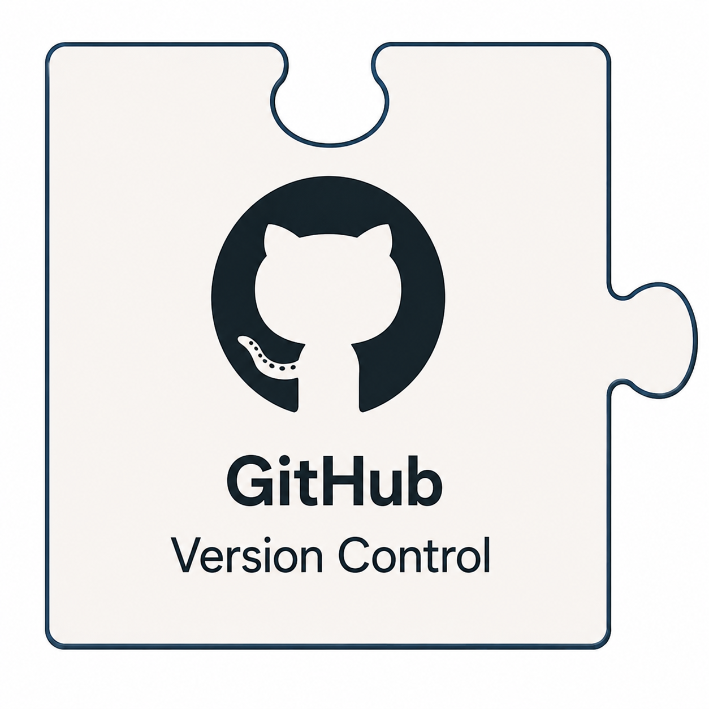

<table border="0" cellpadding="10">
  <tr>
    <td valign="top">
		
    </td>
    <td valign="center">
      
<h2>CAMTREES Database and GitHub</h2>

    </td>
  </tr>
</table>

# {{ page.title }}

<a href="https://github.com" target="_blank">GitHub</a>
is a cloud-based platform where developers store, manage, and collaborate on software
projects using the Git version control system. Files are stored in one or more GitHub
repositories. Each repository is a centralized digital storage space where developers
store project files and track their full revision history. These repositories serve as the
core unit of GitHub, allowing teams to collaborate on code, manage issues, and organize
public or private projects in a cloud-based environment.

Our CAMTREES GitHub account has three distinct repositories:

**Repository #1: camtrees/camtrees.github.io**

This repository is used to maintain the CAMTREES Database Website via
<a href="https://docs.github.com/en/pages" target="_blank">GitHub Pages</a>
which is an integrated static website hosting service provided within the GitHub
ecosystem. GitHub Pages simplifies hosting a website through a standard git push process.
Behind the scenes GitHub Pages is powered by
<a href="https://jekyllrb.com/docs/github-pages/" target="_blank">Jekyll</a>
which makes use of community-maintained themes that allow for the customization
of a web site's layout/presentation. This website uses the 
<a href="https://just-the-docs.com" target="_blank">Just the Docs</a>
theme which provides a layout that is functional and easy to navigate on both phone-sized
and desktop-sized screens.

**Repository #2: camtrees/github-actions**

This repository is used to maintain
<a href="https://github.com/features/actions" target="_blank">GitHub Actions</a>.
We currently have only one action that runs nightly at 2:00am. We call this action
*Create Neon Twin* which is an automation that creates a backup copy of our SQL CAMTREES
Database. Note: our SQL database is stored in a cloud system called Neon.com, hence the
name for the action.

In the future, we will create additional GitHub Actions to help with the automation of
importing EpiCollect data into the SQL database. Currently, the import procedure entails
running Python programs on the database administrator's desktop computer. Once we have
GitHub Actions to assist with that, we will be able to launch those Python programs via a
web browser connected to the GitHub.com website.

**Repository #3: camtrees/codebase**

This repository is used to maintain SQL source code which creates our database's Tables,
Views, Functions, and Triggers. To keep this code current and correct, a database admin
should always update this code, and then run the updated version within an SQL GUI.

This repository also houses Python code used to import EpiCollect data into the CAMTREES
database. These programs cannot run without an auxiliary ".env" file which holds private
keys required to access both EpiCollect projects and the CAMTREES Database stored at
Neon.com. Once these Python programs are created as a GitHub Action (see above), our
private keys will be stored as encrypted GitHub Secrets stored within the repository.
Until then, the ".env" file is kept private to a very few CAM Staff. The same CAM Staff
that have access to the Google Account password.

### How To Best Edit GitHub Files

While files in GitHub repositories can be directly edited on the GitHub.com website, you
will probably find it easier to edit files directly on your local desktop computer with
the help of 
<a href="https://docs.github.com/en/desktop/overview/about-github-desktop" target="_blank">GitHub Desktop</a>.

Using GitHub Desktop, you first 'clone' a GitHub repository to your local computer. You
then modify the files locally using whatever text editor you prefer, and then, you 'push'
those file changes back to the GitHub repository.

This is especially useful for maintaining this website using GitHub Pages. Once you edit
the files locally and push them back to the cloud, GitHub, in the background, regenerates
your website using the changed files. This backend regeneration of the website usually
happens in a few minutes.