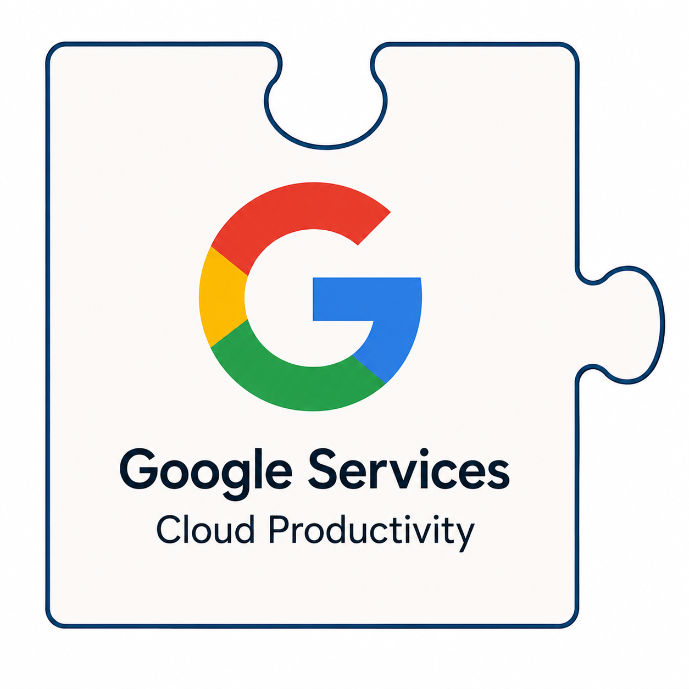

<table border="0" cellpadding="10">
  <tr>
    <td valign="top">
		
    </td>
    <td valign="center">
      
<h2>CAMTREES Database and Google Services</h2>

    </td>
  </tr>
</table>

# {{ page.title }}

Google Services provides three services for the CAMTREES Database project:

**1. A Shared Project Email Address**

Having a shared project email address
[camorgdatabase@gmail.com](mailto:camordatabase@gmail.com)
is crucial. This email address is not used for email communications.
Instead, it is the email address used to create accounts on all the project’s other cloud
services.

Currently, there is a single database administrator (Kenster Rosenberry) who is
responsible for all aspects of the CAMTREES Database project. However, we do not want any
cloud services to be tied to Kenster’s personal credentials. If something were to happen
to Kenster, the project would be locked out of all his accounts, which would be
disastrous.

Therefore, we use the project’s shared camorgdatabase@gmail.com credentials as the user
account not only for Google, but for all other cloud services that support the CAMTREES
Database project: EpiCollect, GitHub, Neon, etc.

Should a new person need to take over as database administrator, we simply reset all
passwords used by the camorgdatabase@gmail.com user account, and the new database
administrator would be ready to go.

One final detail we need for a good succession plan is that all passwords used by the
camorgdatabase@gmail.com user account should be stored in a secure, shared vault
rather than individual browsers or notebooks.
For that, we use
<a href="https://support.apple.com/en-us/120758" target="_blank">Apple’s Shared Group</a>
option in the Password app.

Currently, the following people have access to this shared password group:

* Kenster Rosenberry
* Kim Colson

**2. Google Groups**

<a href="https://groups.google.com" target="_blank">Google Groups</a>
facilitates collaboration through a centralized shared email address.

Utilizing the camorgdatabase@gmail.com user account, we have established a Google Group
titled “Cam Tree Hub Captains.” Members of the group can send emails to
cam-tree-hub-captains@googlegroups.com. Google will subsequently distribute these emails
to all group members. This approach eliminates the need for individuals to maintain their
own lists of Hub Captains. Additionally, new users added to the group can review past
emails sent to the group prior to their membership.

**3. Google My Maps**

<a href="https://www.google.com/maps/about/mymaps/" target="_blank">Google My Maps</a>
enables the creation of a customized map displaying
<a href="https://www.google.com/maps/d/edit?mid=1BnudQOUMWyFeMCpp1HV90hQPCFrWSx0&ll=44.44387186421211%2C-70.31670421000621&z=9" target="_blank">CAM Tree Locations</a>
across Maine.

We can share a link to this map with CAM Volunteers or any other individuals we deem
appropriate.

Further details regarding Google My Maps are available in the “Mapping / GIS” web page
under the “Info for Database Admins” section.
