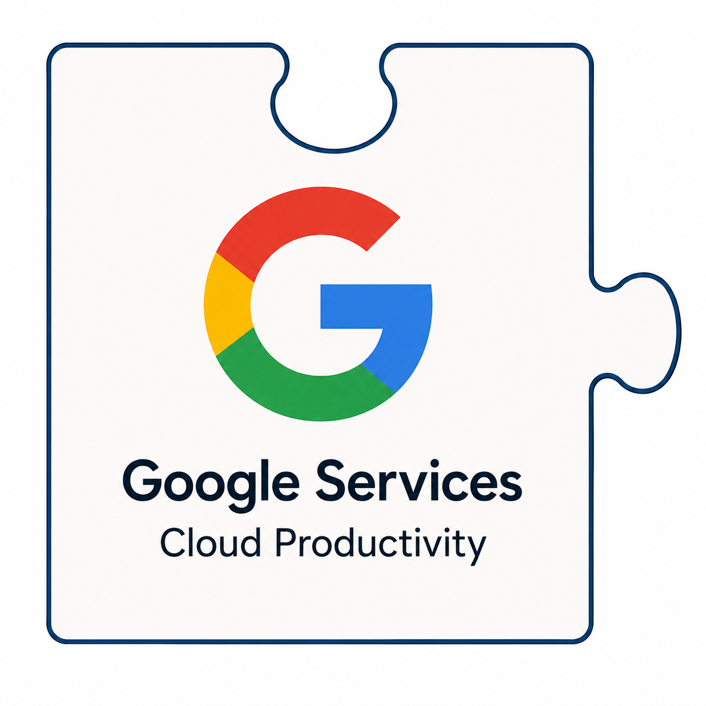

<table border="0" cellpadding="10">
  <tr>
    <td valign="top">
		
    </td>
    <td valign="center">
      
<h2>CAMTREES Database and Google Services</h2>

    </td>
  </tr>
</table>

# {{ page.title }}

Google provides three services that support the CAMTREES Database project:

## 1. Shared Project Account

A dedicated project account,
**[camorgdatabase@gmail.com](mailto:camordatabase@gmail.com)**,
is used as the primary account identity for the CAMTREES project.

This account is **not used for routine email communication**. Instead, it is used to
create and manage accounts for the project's other cloud services, including EpiCollect,
GitHub, Neon, and other services that support the CAMTREES Database.

Using a dedicated project account is an important part of the project's long-term
continuity plan. Cloud services should not be tied to the personal credentials of an
individual administrator. If responsibility for managing the database changes in the
future, the project should be able to continue without losing access to critical services.

When a new database administrator takes over, the transition process is straightforward:

1. Transfer access to the shared project account.
2. Update the passwords for the services associated with that account.
3. Provide the new administrator with access to the required documentation and tools.

To support this continuity plan, all passwords associated with the shared project account
are stored in a secure shared password vault rather than in individual browsers,
notebooks, or personal password managers.

The CAMTREES project uses Apple's
<a href="https://support.apple.com/en-us/120758" target="_blank">Shared Group</a>
feature within the Passwords app for this purpose.

Currently, the following people have access to the shared password group:

- Kenster Rosenberry
- Kim Colson
- Eva Butler

---

## 2. Google Groups

<a href="https://groups.google.com" target="_blank">Google Groups</a>
provides a centralized method for group communication using a shared email address.

Using the project account, we created a Google Group named **Cam Tree Hub Captains**.
Members of this group can send messages to: **cam-tree-hub-captains@googlegroups.com**

Google automatically distributes messages sent to this address to all members of the group.

This approach provides several advantages:

- Individuals do not need to maintain their own separate lists of Hub Captains.
- Adding or removing members only requires updating the Google Group.
- New members can review previous group conversations from before they joined.

---

## 3. Google My Maps

<a href="https://www.google.com/maps/about/mymaps/" target="_blank">Google My Maps</a>
allows CAM to create and share customized maps showing tree locations across Maine.

The current map is available at:
<a href="https://www.google.com/maps/d/edit?mid=1BnudQOUMWyFeMCpp1HV90hQPCFrWSx0&ll=44.44387186421211%2C-70.31670421000621&z=9" target="_blank">CAM Tree Locations</a>

The map can be shared with CAM volunteers and other individuals as appropriate.

Additional information about Google My Maps is available on the **Mapping / GIS** page
under the **Info for Database Admins** section.
