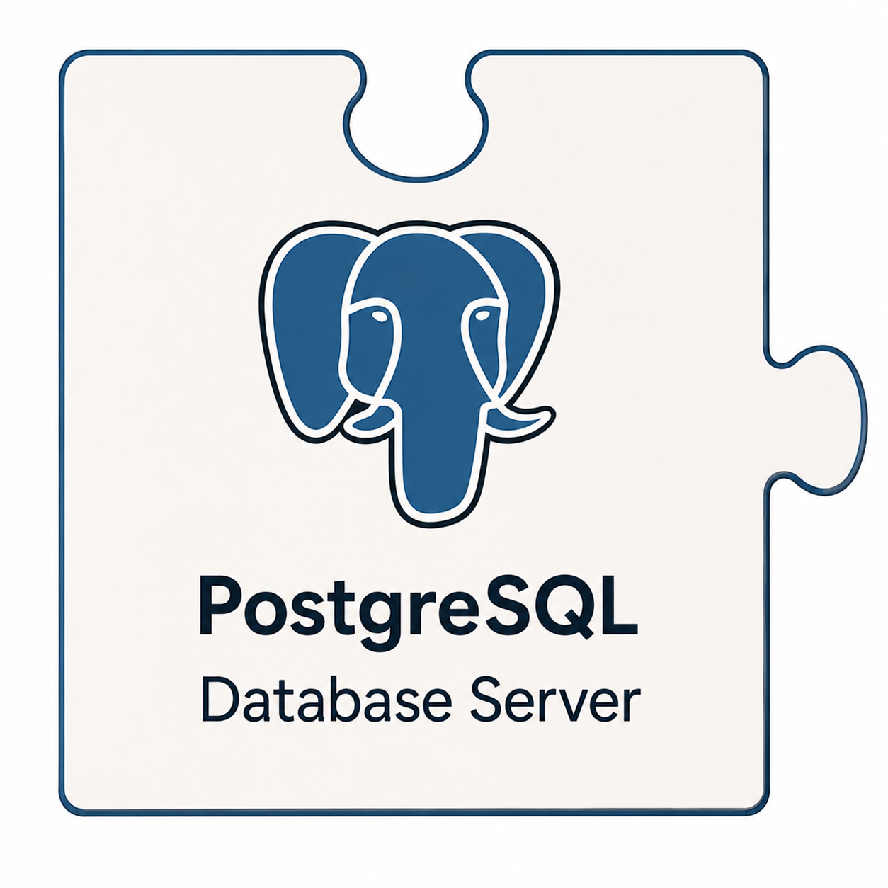

<table border="0" cellpadding="10">
  <tr>
    <td valign="top">
		
    </td>
    <td valign="center">
      
<h2>CAMTREES Database and PostgreSQL</h2>

    </td>
  </tr>
</table>

# {{ page.title }}

Just a placeholder for content yet to be written

* Database host
* SQL Naming Conventions used in the CAMTREES Database
* List of current Tables, Views, Functions

