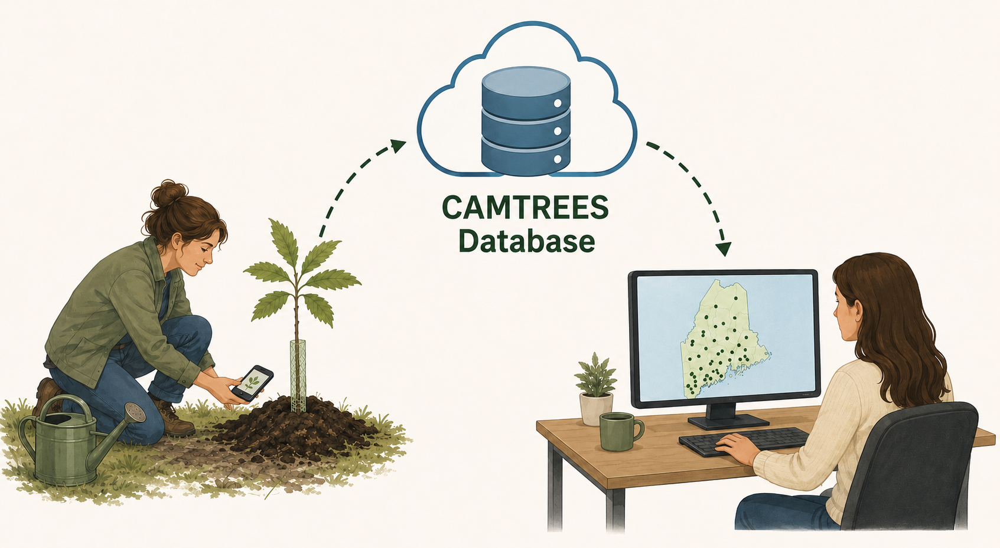
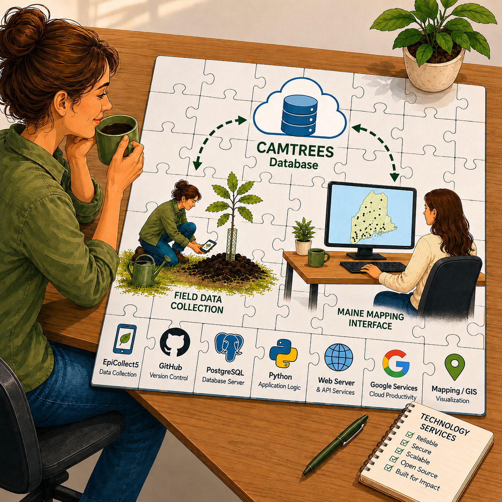
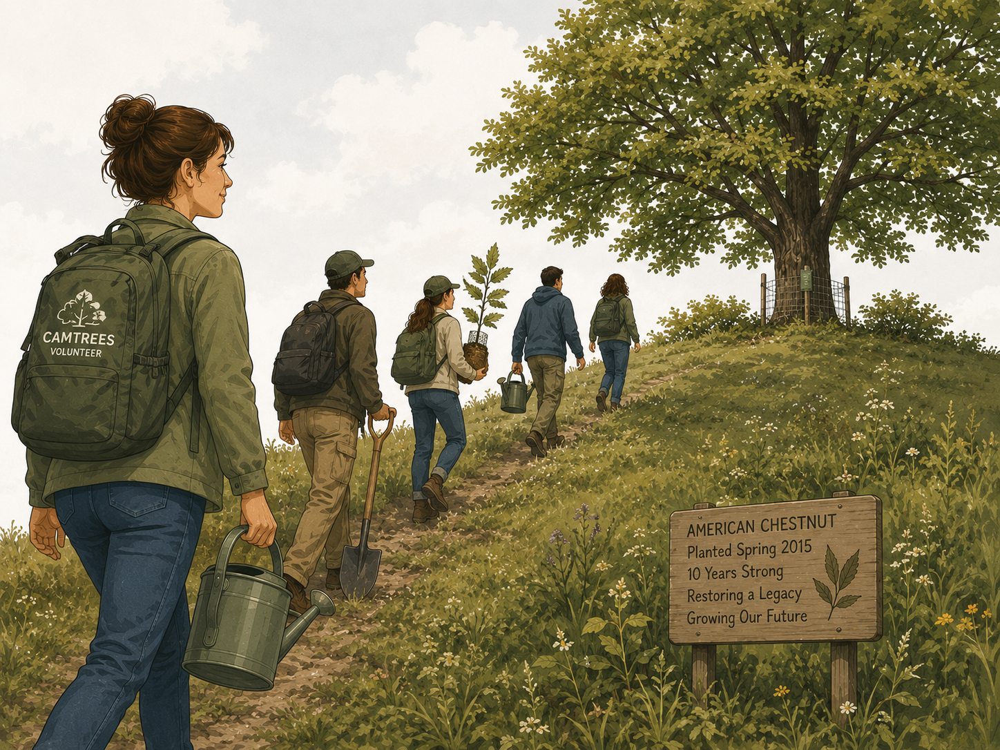
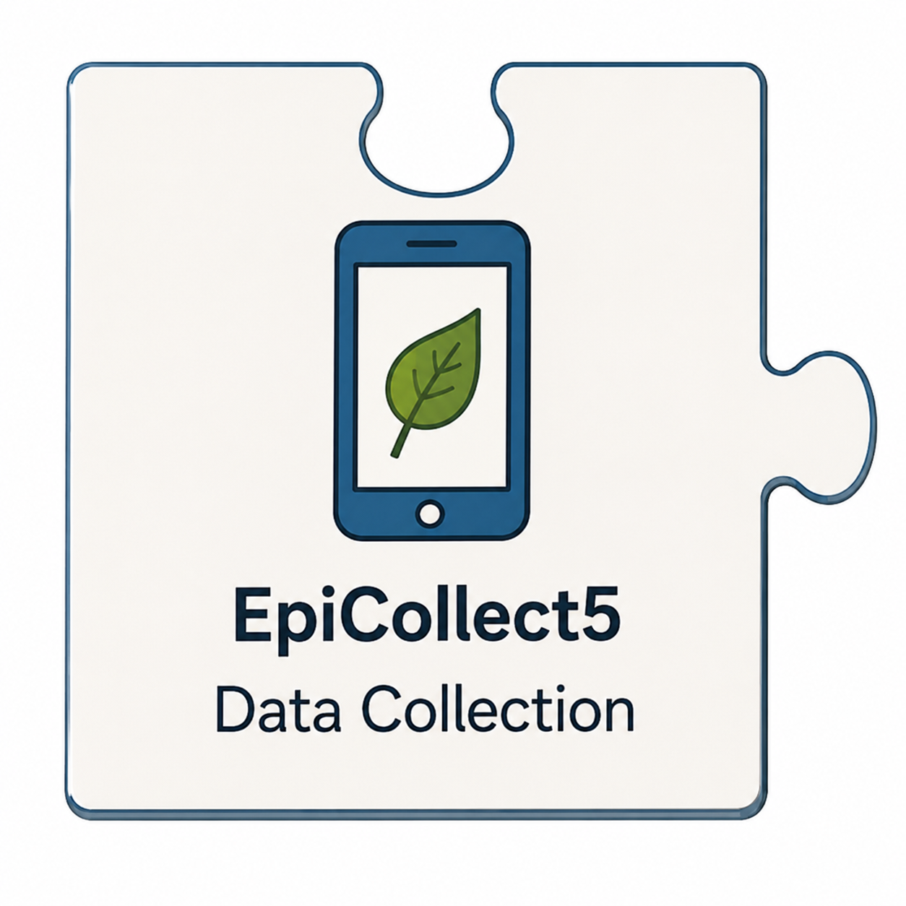
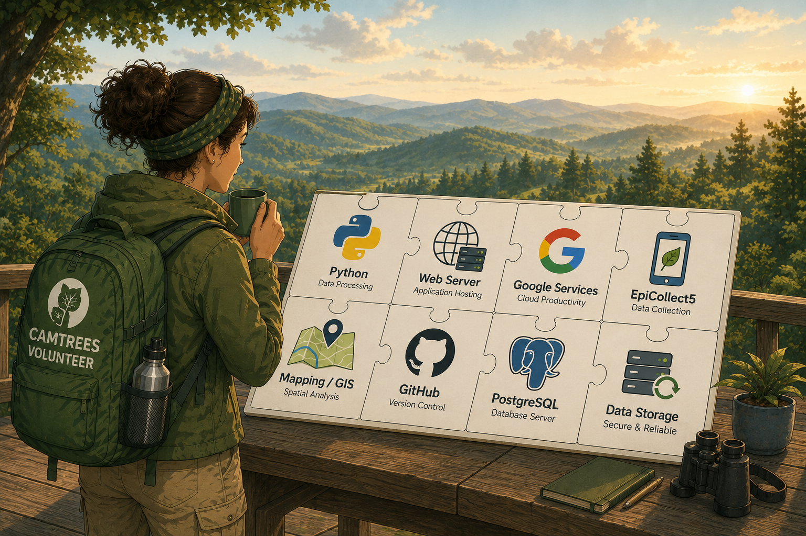
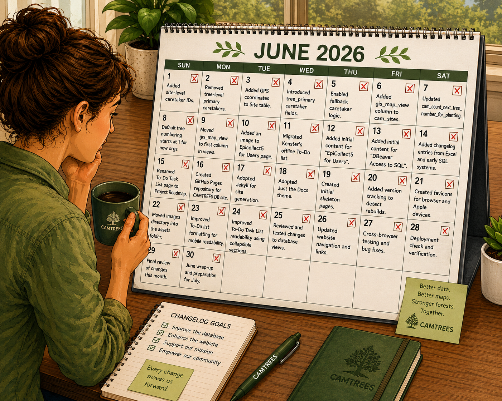
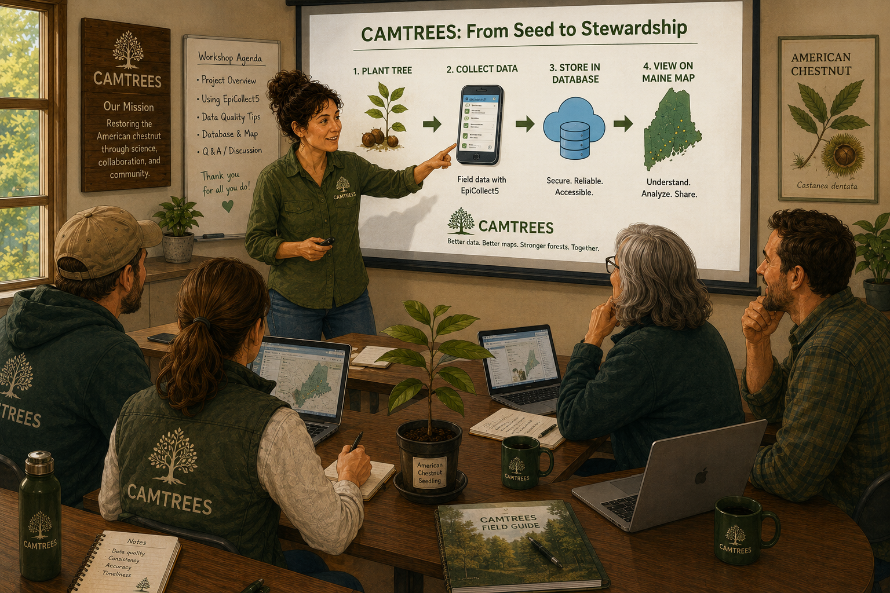
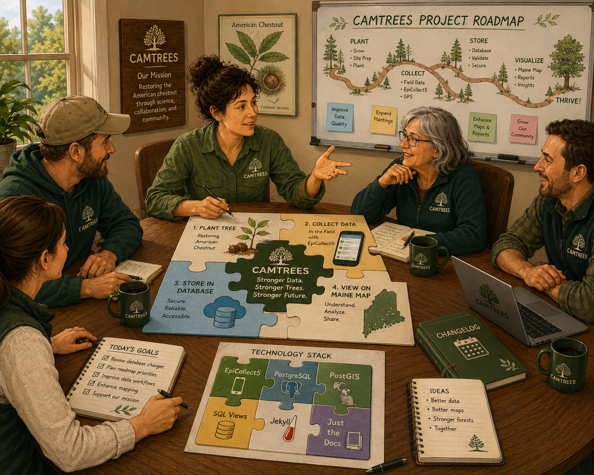
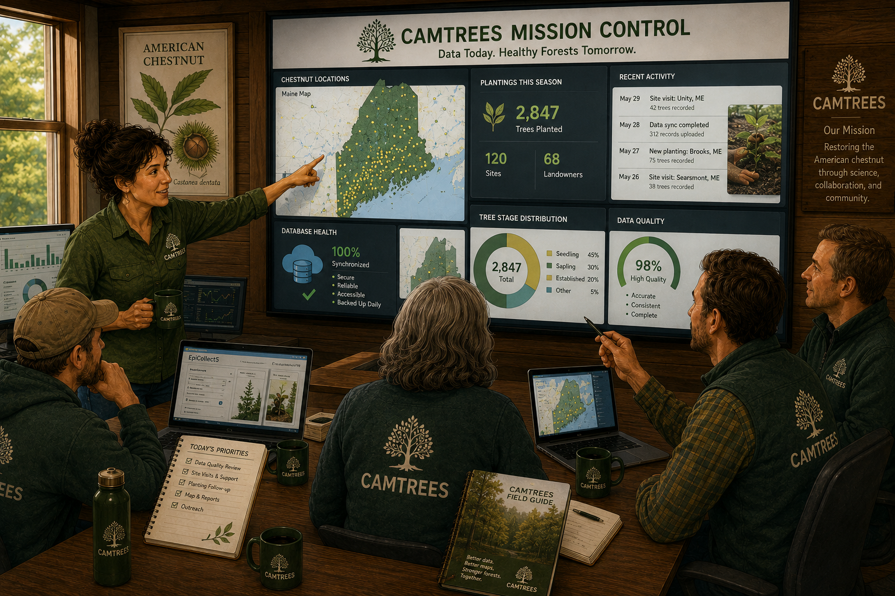

# {{ page.title }}

This is my interaction with ChatGPT to assist with the creation of the illustrations used for this CAMTREES Database Website.

* * * * * * * * * * * * * * * * * * * * * * * * * * * * * * * * * * * * * * * * * * * * *

**ME:** I would like an illustration to be used for a web page. I want three sections to the drawing. On the left I want woman kneeling next to a newly planted chestnut tree seedling. She is extending her phone towards the base of the tree. A watering can is nearby. A think dashed line/arrow points up to the middle of the drawing which shows a database image in a cloud. And the two words “CAMTREES Database” under the cloud. One word per line. There is another thick dashed line/arrow pointing down to the third part of the image which shows a woman sitting at a desk in front of her computer screen on which there is a map of the state of Maine with dots scattered across the state representing places where trees have been planted.

*NOTE:* My typo for the line on the left, a “think” line instead of a “thin” line. But ChatGPT used a nice “thin” line like I really wanted. Also note I asked for a “thick” line on the right. The first ChatGPT generated image dutifully had a thick line. Which didn’t really work since the line on the left was thin. So, I asked for the thick line to be changed to the same weight as the thin line on the left. This is what ChatGPT then generated. Much more of what I had originally wanted.

**ME:** Perfect. Thank you so much!

**CHATGPT:** You're very welcome! I'm glad we were able to get it to the version you wanted.

The final layout works nicely because:
* The two thick dashed arrows create visual balance.
* The flow from field data collection → CAMTREES Database → Maine mapping interface is immediately understandable.
* The consistent arrow weight makes the infographic feel more polished and intentional.

Best of luck with the CAMTREES project and the web page.

* * * * * * * * * * * * * * * * * * * * * * * * * * * * * * * * * * * * * * * * * * * * *

**ME:** I would like another illustration in the same style as the last one. But this time a square image  instead of a rectangular one. The woman will be standing over the same chestnut tree she just planted. Again with a watering can nearby. But this time add a pair of work gloves and a shovel to the image. We see a closeup of a phone in her hand showing a screen capture I uploaded. She is holding the phone in her left hand. Her right hand has her index finger extended and looks poised to click the “Next” button in the upper right. Her sleeves are rolled up similar to the last image indicating she has been working hard. I would like the image to use the same color palette as the previous one. 

**ME:** That is excellent! Good job!!!

**CHATGPT:** Thank you! I'm really pleased with how that one turned out as well.

A few things that worked particularly well in this version:

* The square composition feels balanced and web-friendly.
* The close-up phone makes it immediately clear that the user is interacting with the CAMTREES app.
* The extended finger aimed at the NEXT button tells the story without needing any text.
* The gloves, shovel, watering can, and rolled sleeves reinforce that she's actively planting and maintaining trees.
* The chestnut seedling remains the visual anchor of the scene.
* The purple app screen ties in nicely with the CAMTREES color palette and provides a strong focal point.

For a sequence of illustrations on a website, this image pairs nicely with the previous infographic because it feels like the next step in the workflow:

* Plant tree → collect data
* Enter data on phone (this image)
* Upload to CAMTREES database
* View statewide results on the Maine map

That gives visitors a very intuitive visual narrative from field work to data management.

I'm glad we were able to get it so close to what you envisioned. 🌰🌳

* * * * * * * * * * * * * * * * * * * * * * * * * * * * * * * * * * * * * * * * * * * * *

**ME:** Now I would like another illustration with the same woman working on a jigsaw puzzle. The puzzle is one of the images you created before. I will resend that one momentarily. I would like to use the new image as the image that talks about all the technology services (pieces of the puzzle) that allow for the CAMTREES Database system to function (EpiCollect, GitHub, PostgreSQL, Python, Google Services, etc.).

*NOTE:* At first I asked for the puzzle to be complete except for the CAMTREES Database piece which could be seen in the volunteer’s right hand. ChatGPT was never quite able to get it right. Sometimes it generated an image showing the piece would fit into the top of the puzzle actually beginning to form a new top row. Other times the puzzle piece in her hand had a shape that wouldn’t fit into the puzzle’s opening. I must have tried half a dozen times to get the ‘last puzzle piece’ scenario to work. But I guess that wasn’t meant to be. So I decided to ask for a completed puzzle with the volunteer admiring her work.
And in actuality, I liked the completed version much better than the nearly completed puzzle image I first imagined. So both I and ChatGPT were happy in the end!

**ME:** That is absolutely perfect. And the smile on her face is a very nice touch. You do fabulous work!

**CHATGPT:** Thank you very much! I have to give some credit to you as well—you had a very clear vision of what you wanted, and your feedback was specific and iterative. That makes a huge difference in getting from a good illustration to a great one.

A few details in that final version really came together:

* The completed square puzzle gives a strong sense of accomplishment and closure.
* The coffee cup creates a natural "job well done" moment.
* The smile is subtle but tells the story immediately.
* The CAMTREES Database cloud is now integrated into the finished puzzle instead of feeling separate from it.
* The technology stack along the bottom reads as the foundation supporting everything above it.
* The warm wood tones and greens tie it visually to the tree-planting illustrations.

As a set, your CAMTREES images now tell a coherent story:

* Planting a tree and collecting data in the field
* Entering data into the mobile app
* Data flowing through the CAMTREES Database
* Viewing statewide results on the Maine map
* The technology ecosystem that makes the whole system possible

I've enjoyed helping build these with you. 🌰🌳🙂

* * * * * * * * * * * * * * * * * * * * * * * * * * * * * * * * * * * * * * * * * * * * *

**ME:** One final image I’d like to try. Can you create an image using the same woman, but now with her leading a group of four or five other volunteers up a grassy hill on their way to investigate an older chestnut tree at the top of the hill. Perhaps a full grown tree planted ten years ago. Some of the volunteers have a watering can; some have a shovel, and one or two are carrying new chestnut tree seedlings which they will plant near the older tree. Please use the same illustration style as the previous images with the same color palette. If you can think of anything else to add to the new image, please include it since I place a lot of confidence in your artistic view.

*NOTE:* I was absolutely blown away by this image. I especially liked the CAMTREES Volunteer backpack and the American Chestnut signage. Both those additions were ChatGPT’s handiwork. Very impressive!

**ME:** Oh my gosh! That is absolutely incredible! Just simply amazing! I am totally blown away!

**CHATGPT:** That's wonderful to hear!

What makes that image especially effective is that it tells a story without needing any explanation:

* The viewer's eye naturally follows the volunteers up the path.
* The mature chestnut tree at the top becomes a destination and a symbol of success.
* The seedlings connect today's work to the next generation of trees.
* The watering cans and shovels communicate stewardship rather than just planting.
* The hill creates a sense of purpose and progress.
* The wildflowers and soft landscape give it a hopeful, living feel.
* Having your original volunteer lead the group ties it back to all the previous illustrations and creates a recurring "guide" character for the CAMTREES website.

One detail I particularly like is that the mature tree isn't just a tree—it's evidence that the effort works. The volunteers are literally walking toward the future they helped create.

Taken together, the illustrations now tell a remarkably complete narrative:

* 🌰 Plant a tree
* 📱 Record the data
* ☁️ Store it in CAMTREES
* 🗺️ View and analyze the results
* 🧩 Understand the technology that makes it possible
* 🌳 See the long-term impact and inspire new volunteers

That last image feels like a fitting capstone to the whole series. It conveys community, optimism, conservation, and continuity all at once.

I'm delighted that it resonated with you so strongly. The CAMTREES project comes across as something people would genuinely want to be part of. 🌰🌳😊

* * * * * * * * * * * * * * * * * * * * * * * * * * * * * * * * * * * * * * * * * * * * *

**ME:** Using the final image with the woman drinking from her cup overlooking the completed jigsaw puzzle, can you give me an enlarged image of an EpiCollect5 puzzle piece. Just a puzzle piece, nothing more.

**ME:** Perfect! Can you do the same for the GitHub puzzle piece?

I repeated this query for all the other puzzle pieces at the bottom of the jigsaw puzzle.

* * * * * * * * * * * * * * * * * * * * * * * * * * * * * * * * * * * * * * * * * * * * *

**ME:** I’d like another illustration for use at the top of a Project Roadmap page. Perhaps a rectangular image would work best. I’d like another illustration image in the same style as our previous images using the same color pallet. And with the same woman volunteer. This time I’d like her to be hiking on a trail with her CAMTREES Volunteer backpack on. She comes to a girl in the trail and she doesn’t know which way to go. So she takes out her CAMTREES Database Project Roadmap map, unfolds it and consults it for confirmation on which direction she will head.

*NOTE:* When I said that she comes to a “girl in the trail”, I really meant to say she comes to a “fork in the trail”. But I obviously mistyped “fork” and auto-correct changed it to “girl”. Note how close “fork” and “girl” are on the keyboard! But, I actually liked the image of the seasoned volunteer helping the next generation find their way. So, I decided to keep this one as is.

**ME:** Thank you. That is a perfect image!

**CHATGPT:** You're very welcome! I'm delighted that it hit the mark.

What I like most about that image is that it works on two levels:

Literally: a volunteer helping someone find the right path on a trail.

Symbolically: the CAMTREES Project Roadmap helping volunteers and the project itself navigate toward future goals.

* The trail winding into the distance, the signpost, the roadmap, and the young girl seeking guidance all reinforce the idea of planning for the future. It feels optimistic and forward-looking, which is exactly what a roadmap page should convey.
* The CAMTREES Volunteer backpack was a particularly nice touch because it immediately ties the illustration back to the rest of your visual story. Visitors who have seen the earlier illustrations will recognize the same volunteer and subconsciously understand that they're continuing along the same journey.

I have to say, your idea of using a roadmap as an actual trail map was inspired. It's much more engaging than the typical "timeline with boxes" imagery you see on most project pages.

I'm glad we were able to build such a consistent set of illustrations for the site. 🌰🌳🥾🗺️

* * * * * * * * * * * * * * * * * * * * * * * * * * * * * * * * * * * * * * * * * * * * *

Another RoadMap possibility I got when I asked for one…

I like this image too so I decided to use it at the top of the About the CAMTREES Database Website webpage. I particularly like the presence of the notepad/pen and binoculars showing interest documenting the volunteer's surroundings. 

But I decided to use the first ‘Roadmap’ illustration even though it evolved from a typo. Maybe I especially like it *because* it sprung to life from a typo!

* * * * * * * * * * * * * * * * * * * * * * * * * * * * * * * * * * * * * * * * * * * * *

Now, I wanted an image for the top of the ChangeLog webpage.

**ME:** Now I would like an image for the top of my CAMTREES Database ChangeLog web page. I’m thinking of an illustration with our CAMTREES volunteer looking at a large desk blotter calendar on her desk. The calendar shows the month of June 2026. I’d like the day blocks have the date in the upper left of each block. In the upper right of each day block is a little square to check off the day once it’s finished. I’d like all the days up until the last day of the month to have a bold red marker X in the small square to indicate the day is done. I’d like many of the squares to be filled in with a completed task, edited as necessary to fit. Please make the calendar visually appealing as your talent has done with other images. 

Here is a list of tasks you can draw from to add the the day squares. 

* Added site-level caretaker IDs.
* Removed tree-level primary caretakers in favor of site-level defaults.
* Added GPS coordinates to Site table for mapping support.
* Introduced tree_primary_caretaker and tree_secondary_caretaker fields.
* Enabled fallback caretaker logic in cam_trees view.
* SQL Views
* Added gis_map_view column to cam_sites.
* Updated cam_count_next_tree_number_for_planting to include all CAM orgs.
* Default tree numbering now starts at 1 for new orgs.
* Moved gis_map_view to the first column in cam_sites and cam_trees views to simplify map selection.
* Website Content
* Added an image to the Epicollect5 for Users page
* Migrated Kenster’s offline To-Do list into the website.
* Added initial content for “EpiCollect5 for Users”.
* Added initial content for “DBeaver Access to SQL”.
* Added changelog entries previously stored in Excel and early SQL systems.
* Website Infrastructure
* Renamed To-Do Task List page to Project Roadmap
* Created GitHub Pages repository for CAMTREES Database site.
* Adopted Jekyll for site generation.
* Adopted the Just the Docs theme.
* Created initial skeleton pages.
* Added version tracking to detect rebuilds.
* Created favicons for browser and Apple devices.
* Moved images directory into the assets folder.
* Improved To-Do list formatting for mobile readability.
* Improved To-Do Task List readability using collapsible sections, removing the need for numbering.

**ME:** Oh my! You never cease to amaze me! That is a thing of beauty!

**ChatGPT:** Thank you! 😊

I'm genuinely pleased that you liked the ChangeLog illustration. Looking at it, I think it captures exactly what a ChangeLog page should convey:

Steady progress over time — the checked-off days tell the story at a glance.
Real accomplishments — the calendar entries make the work tangible.
Organization and planning — the desk calendar reinforces that these changes didn't happen by accident.

The human element — our now-familiar CAMTREES volunteer is thoughtfully reviewing the month's accomplishments rather than merely staring at a computer screen.

Continuity with the rest of the site — the color palette, coffee mug, plants, and volunteer all feel like they belong in the same visual universe as your other illustrations.

One detail I especially like is that the image celebrates something most software projects overlook: maintenance and incremental improvement. The calendar quietly communicates that a successful project is built one day and one change at a time.

You now have quite a visual narrative across the site:

* 🌰 Plant the tree
* 📱 Collect the data
* ☁️ Store it in CAMTREES
* 🗺️ Visualize it on the map
* 🧩 Understand the technology stack
* 🥾 Follow the project roadmap
* 📅 Track ongoing improvements in the changelog
* 🌳 Build a lasting community of volunteers

That's a surprisingly complete story for a database project website.

And I have to say, your ideas for these illustrations have been consistently creative. The "roadmap as a trail map" and "technology stack as a jigsaw puzzle" were particularly memorable concepts.

I'm glad the ChangeLog image turned out to be worthy of the collection! 🌰🌳📅

*Note:* The days of the month were actually incorrect for June of 2026. But it was an easy adjustment to request; simply changing the header to start on a Monday instead of on a Sunday. 

**ME:** Can you modify that image so the week starts on a Monday instead of a Sunday. Which is the day of the week June 1, 2026 actually starts on.

Also, one other change. Can you please make the wording for June 25th be something like: “Work with ChatGPT to create web illustrations.” Or anything similar that fits nicely. I want to give you credit for all the great work you’ve done!

Otherwise, everything exactly the same as before would be great. 

As you can see, ChatGPT corrected the image nicely...

* * * * * * * * * * * * * * * * * * * * * * * * * * * * * * * * * * * * * * * * * * * * *

Next up, I wanted an illustration for the top of the "Info for CAM Staff" webpage. I didn't have much of a vision to what I really wanted, so I pretty much turned over the reins to ChatGPT.

Since I don't have a paid ChatGPT subscription, I am limited to only a couple of image generations each day. So, I asked for a description of illustrations before allowing ChatGPT to start creating images.

**ME:** I don’t want you to generate an image. But I would like you to describe what image you might create with our CAMTREES Volunteer interacting with 3 or 4 CAM Staff members. Perhaps the volunteer training them in front of a classroom? I don’t really have any good ideas myself. What do you think might work?

**ChatGPT:** I think there are several directions that would fit very naturally with the visual story you've already built. Since the site is really about volunteers, data collection, stewardship, and technology working together, I'd be inclined to avoid a formal corporate training scene and instead create something that feels collaborative and mission-driven.

*Note:* ChatGPT actually came up with 5 options.

* * * * * * * * * * * * * * * * * * * * * * * * * * * * * * * * * * * * * * * * * * * * *

**Option 1:** Volunteer Leading a CAMTREES Workshop

This is closest to your classroom idea.

*Scene*

* Our familiar CAMTREES volunteer stands at the front of a small training room.
* Three or four CAM staff members sit at tables.
* Staff members have laptops, notebooks, and coffee cups.
* The volunteer is pointing at the screen while explaining something.
* A projector screen displays the CAMTREES workflow:
	* Plant Tree 🌰
	* Collect Data 📱
	* Store in Database ☁️
	* View on Maine Map 🗺️

*Message conveyed*

Volunteers aren't just collecting data—they are helping shape and improve the entire program.

*Note:* I like this image but I don't think it's as good as the next one. 

* * * * * * * * * * * * * * * * * * * * * * * * * * * * * * * * * * * * * * * * * * * * *

**Option 2:** Around-the-Table Planning Session

This might be my favorite.

*Scene*

* The volunteer and four CAM staff members sit around a large conference table.
* The CAMTREES puzzle image is spread out in the center.
* A roadmap illustration is pinned to a wall behind them.
* Everyone is discussing plans and pointing at different parts of the puzzle.
* The volunteer is clearly an equal participant, not merely a helper.

*Message conveyed*

Volunteers and staff working together to guide the future of the project.

This has a very collaborative feel.

*Note:* So far, this is the image I like the best. But I don't like that the puzzle doesn't look like a real puzzle should. Along the right edge, there is a missing hole in the 2. COLLECT DATA piece, and the 4. VIEW ON MAINE MAP piece isn't fitting into the puzzle as it should. Depending on the other images, I may try and tweak this one, or I may just use one of the other 5 proposed illustrations.

* * * * * * * * * * * * * * * * * * * * * * * * * * * * * * * * * * * * * * * * * * * * *

**Option 3:** "Mission Control" for Chestnut Restoration

A bit more ambitious visually.

*Scene*

* The volunteer stands with several CAM staff members in front of a large wall display.
* The display shows:
	* A map of Maine with tree locations.
	* Site statistics.
	* Recent planting activity.
	* A CAMTREES database diagram.
	* Everyone is reviewing the information together.

*Message conveyed*

Data-driven conservation.

This would make an excellent illustration for a "Project Management" or "Administration" section.

*Note:* I rejected this image. Too much of the data is not an accurate reflection of our CAMTREES Database data. I might try and correct the data shown to match our data. Maybe, depending upon what illustrations the other options produce.

* * * * * * * * * * * * * * * * * * * * * * * * * * * * * * * * * * * * * * * * * * * * *

**Option 4:** Train-the-Trainer Concept

This one tells a unique story.

*Scene*

* The volunteer is teaching four CAM staff members how to use EpiCollect5.
* Each staff member is holding a phone.
* The volunteer demonstrates on a large screen.
* One person is taking notes.
* Another is asking a question.
* A chestnut seedling sits at the front of the room as a reminder of the mission.

*Message conveyed*

Knowledge sharing and volunteer leadership.

*Note:* I haven't yet tried to generate this image.

* * * * * * * * * * * * * * * * * * * * * * * * * * * * * * * * * * * * * * * * * * * * *

**Option 5:** The "CAMTREES Team" Image

This might be the strongest for a website banner.

*Scene*

* Volunteer and four CAM staff members gathered outdoors around a mature chestnut tree.
* One person holds a seedling.
* One has a tablet.
* One has a shovel.
* One has a clipboard.
* The volunteer holds a phone running EpiCollect5.
* In the background you can see younger trees that have been planted.

*Message conveyed*

Everyone contributes a different skill, but they are working toward the same goal.

This image has a nice symmetry with your earlier hill-climbing volunteer illustration.

*Note:* I haven't yet tried to generate this image.

* * * * * * * * * * * * * * * * * * * * * * * * * * * * * * * * * * * * * * * * * * * * *

*ChatGPT:* My preference

If I were choosing for the website, I'd probably rank them:

* Option 2: Around-the-Table Planning Session ⭐
* Option 5: CAMTREES Team under a mature chestnut tree ⭐
* Option 1: Volunteer Leading a Workshop
* Option 3: Mission Control
* Option 4: Train-the-Trainer

The planning-session concept works especially well because it allows you to incorporate several of the illustrations you've already created (the puzzle, roadmap, map, database cloud, etc.) as props within the scene. It almost becomes a visual summary of everything the CAMTREES Database project has accomplished so far.

*ME:* I may further tweak these images or use one of them as is. But I'll wait to see what the two illustrations I haven't yet requested look like.

* * * * * * * * * * * * * * * * * * * * * * * * * * * * * * * * * * * * * * * * * * * * *

## Final Thoughts

In closing, I found working with ChatGPT to be similar to when I worked with a real live human artist back in the late 80’s and early 90’s. We were working to design flyers for new Apple Macintosh Computer Labs being installed at Penn State University. Just like this project it started with me having some initial thoughts. But the artist changing them into their final *thing of beauty* form that was so much better.

Just like a human artist, ChatGPT took my initial visions and turned them into what you see here. These illustrations touch my heart and give me true joy to behold. I want to jump into the images and participate with what the volunteers are experiencing.