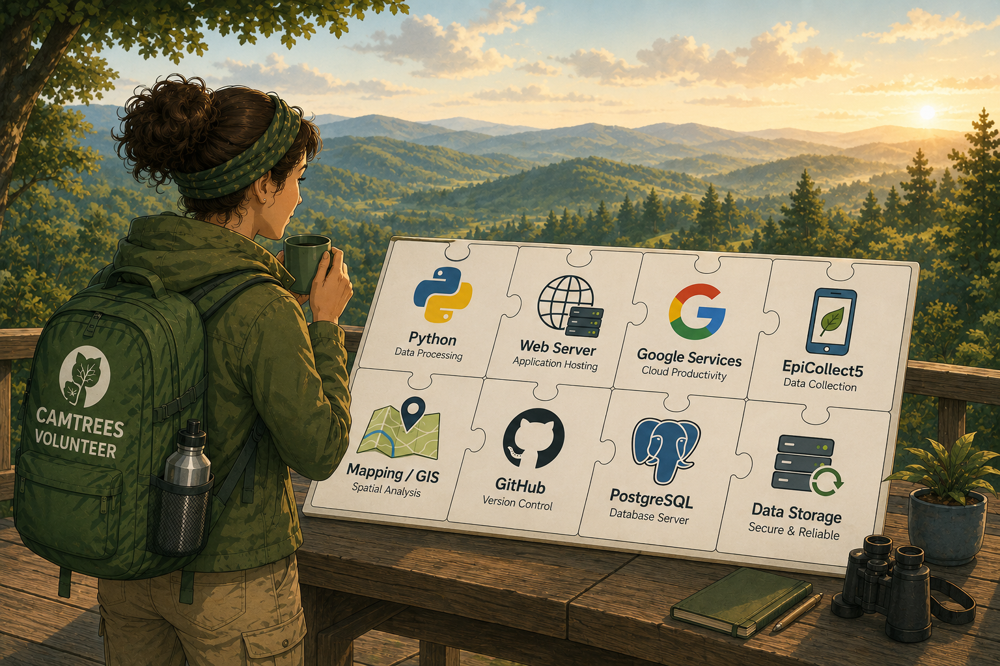

# {{ page.title }}

This website was created by
<a href="https://about.me/kenster/" target="_blank">Kenster Rosenberry</a>.

The illustrations used throughout this website, including the illustration shown above,
began as concepts developed by Kenster. They were then refined and transformed into
finished artwork using
<a href="https://chatgpt.com/images/" target="_blank">ChatGPT's image generation tools</a>.

The goal of these illustrations is not simply to add decorative images to the website.
Instead, they are intended to create a consistent visual language that helps explain the
people, processes, and technology behind the CAMTREES Database system.

The experience of using ChatGPT to create these illustrations was both surprising and
impressive. The process felt remarkably similar to collaborating with a human designer or
artist. What stood out most was ChatGPT's ability not only to generate images, but also to
discuss design choices, visual composition, and how each illustration supported the
intended message.

Creating these illustrations became an iterative creative process: combining human ideas,
direction, and refinement with AI-assisted design and visualization. The result is a
collection of images that help communicate complex ideas—such as field data collection,
database technology, volunteer workflows, and project collaboration—in a way that is
approachable and easy to understand.