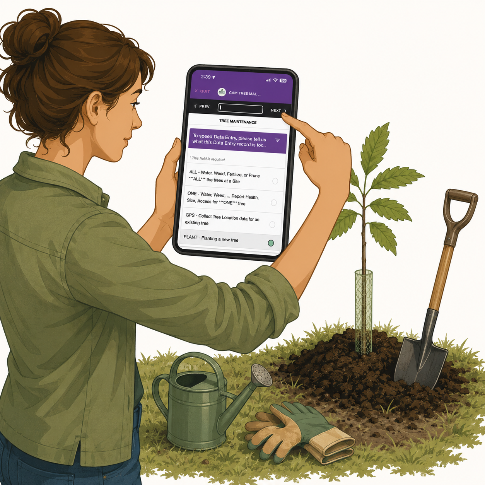

<table border="0" cellpadding="10">
  <tr>
    <td valign="top">
      
    </td>
    <td valign="center">
      
<h2>Using the   EpiCollect5   Mobile App</h2>

    </td>
  </tr>
</table>

# {{ page.title }}

## Overview

The <a href="https://five.epicollect.net" target="_blank">EpiCollect5 mobile app</a> is a free, easy-to-use field data collection platform developed by Oxford University.

The app is currently available for:

- iOS devices (version 15 and newer)
- Android devices (version 10 and newer)

EpiCollect5 allows CAM volunteers to collect tree data while working in the field—even when standing next to a chestnut tree without cellular service.

When an Internet connection is available, collected data can be uploaded immediately to the EpiCollect servers. If no connection is available, data is stored on the phone and uploaded later when Internet access becomes available.

CAM began using EpiCollect5 in spring 2025. Volunteers have found the app easy to use and reliable for collecting information during two primary activities:

- Planting new chestnut trees.
- Recording information about existing trees.

---

## Preparing EpiCollect5 Before Going Into the Field

Before collecting data in the field, confirm that your EpiCollect5 app has the latest version of the CAM Tree Maintenance form.

This step must be completed while you have an Internet connection.

1. Launch EpiCollect5.

2. If you are not already on the Project Selection screen:
   - Tap the **< Projects** button in the upper-left corner until the Project Selection screen appears.

3. Select the **CAM Tree Maintenance** project.
   - If EpiCollect indicates that the project form has been updated, tap **OK**.
   - Tap **OK** again after the update is complete.

4. Tap the **< Projects** button again to return to the Project Selection screen.

Your phone is now ready for field data collection.

---

## Choosing a Data Collection Pathway

When collecting tree information in the field, first select the appropriate:

* **CAM Organization**
* **Tree Site**

You will then select one of the following six pathways depending on the activity being performed.

| Pathway      | Purpose                                                                  |
| ------------ | ------------------------------------------------------------------------ |
| **PLANT**    | Recording information when planting a new tree                           |
| **GPS**      | Recording the GPS location of an existing tree                           |
| **ONE**      | Recording health information or performing care actions on a single tree |
| **ALL**      | Recording care actions performed on all trees at a site                  |
| **WildCAM**  | Recording information about a wild tree not previously known to TACF     |
| **WildTACF** | Recording information about a wild tree already known to TACF            |

Kim Colson has created the comprehensive
<a href="https://camtrees.github.io/assets/cam-epicollect5-quick-reference-guide-1.0.pdf" target="_blank">CAM EpiCollect5 Quick Reference Guide</a>,
which provides detailed instructions for using the app in the field.

---

# EpiCollect5 Data Fields by Pathway

The following sections describe the information collected through each EpiCollect5 pathway.

<strong>PLANT — Planting a New Tree</strong>

Used when recording information about a newly planted tree.

* **CAMorg-Site** — The CAM Organization and Site where the tree lives.
* **Tree Number** — The tree's three-digit identifier with leading zeroes.
* **Mother Tree** — The tree's mother.
* **Mother Tree Other** — A mother tree not included in the EpiCollect selection list.
* **Father Tree** — The tree's father.
* **Father Tree Other** — A father tree not included in the EpiCollect selection list.
* **Parent Tree Note** — Additional information regarding the tree's lineage.
* **Tree GPS Location** — The tree's GPS coordinates.
* **Access Path** — Wheelchair-accessible trail, hiking trail, auto road, etc.
* **Access Level** — Easy, Moderate, or Difficult.
* **Access Note** — Additional information regarding tree accessibility.
* **Planting Method** — Short Tube, Tall Tube, etc.
* **Wire Fence** — Indicates whether a wire fence was placed around the tree.
* **Tree Photos** — One photo of the tree tag and one photo of the tree.
* **Care Actions** — Actions performed, such as watering or weeding.
* **Additional Info** — Any additional planting information.

<strong>GPS — Recording an Existing Tree Location</strong>

Used when recording or updating the GPS location of an existing tree.

* **CAMorg-Site** — The CAM Organization and Site where the tree lives.
* **Tree Number** — The tree's three-digit identifier with leading zeroes.
* **Tree GPS Location** — The tree's GPS coordinates.
* **Additional Info** — Information helpful for locating the tree.

<strong>ONE — Recording Health Data or Care Actions for a Single Tree</strong>

Used when recording health information or performing care actions on one tree.

* **CAMorg-Site** — The CAM Organization and Site where the tree lives.
* **Tree Number** — The tree's three-digit identifier with leading zeroes.
* **Health** — Good, Poor, or Dead.
* **Height** — Tree height measured in feet and inches.
* **Diameter** — Tree diameter measured at breast height.
* **Blight** — Whether the tree shows signs of blight.
* **Form** — Straight or Branching.
* **Stump Sprouting** — Whether stump sprouts are present.
* **Catkins** — Whether catkins are present.
* **Blossoms** — Whether blossoms are present.
* **Nut Production** — None, Some, or Many.
* **Access Method** — Equipment required for harvesting or pollination.
* **Tree Photos** — Two photos of the tree.
* **Care Actions** — Actions performed, such as watering or weeding.
* **Additional Info** — Any additional observations.

<strong>ALL — Recording Care Actions for All Trees at a Site</strong>

Used when recording care actions performed on all trees at a site.

* **CAMorg-Site** — The CAM Organization and Site where the trees live.
* **Care Actions** — Actions performed, such as watering or weeding.
* **Additional Info** — Any additional information about the trees.

<strong>WildCAM — Recording a Newly Discovered Wild Tree</strong>

Used when recording information about a wild chestnut tree not previously known to TACF.

* **Tree GPS Location** — The tree's GPS coordinates.
* **Access Path** — Wheelchair-accessible trail, hiking trail, auto road, etc.
* **Access Level** — Easy, Moderate, or Difficult.
* **Access Note** — Additional information regarding accessibility.
* **Health** — Good, Poor, or Dead.
* **Height** — Tree height measured in feet and inches.
* **Diameter** — Tree diameter measured at breast height.
* **Blight** — Whether the tree shows signs of blight.
* **Form** — Straight or Branching.
* **Stump Sprouting** — Whether stump sprouts are present.
* **Catkins** — Whether catkins are present.
* **Blossoms** — Whether blossoms are present.
* **Nut Production** — None, Some, or Many.
* **Access Method** — Equipment required for harvesting or pollination.
* **Tree Photos** — Two photos of the tree.
* **Care Actions** — Actions performed.
* **Additional Info** — Any additional information about the wild tree.

<strong>WildTACF — Recording a Known TACF Wild Tree</strong>

Used when recording information about a wild tree already known to TACF.

* **Tree ID** — The TACF identifier (for example, ME-XX###).
All other information collected for a WildCAM tree.

