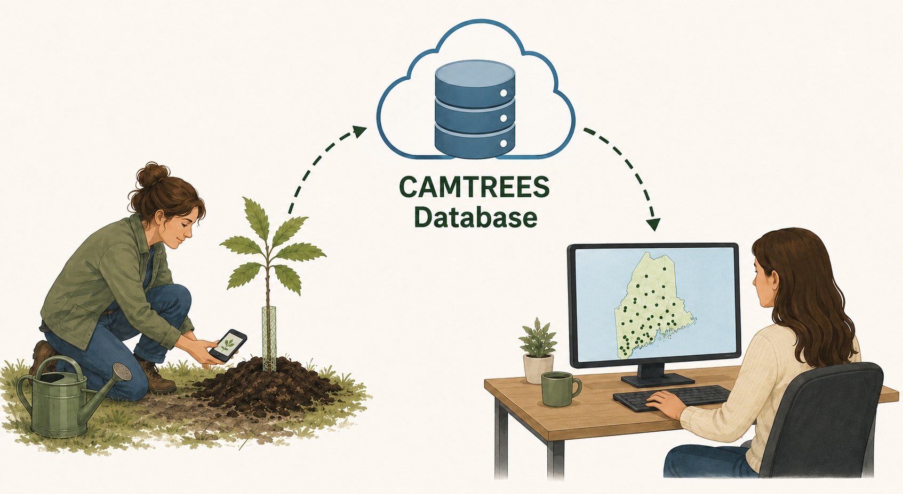

# {{ page.title }}

There are three groups of Chestnuts Across Maine (CAM) volunteers, each playing an
important role in supporting CAM's mission.

## CAM Volunteers

CAM Volunteers assist with:

- Planting chestnut trees.
- Watering trees during periods of drought.
- Performing periodic tree health assessments.

## Hub Captains

Hub Captains help coordinate local volunteer activities by:

- Organizing and supporting CAM Volunteers within their area.
- Recording rainfall events throughout the spring, summer, and fall.

## Chestnut Chasers

Chestnut Chasers are trained volunteers who help locate and document chestnut trees
growing in the wild. Their responsibilities include:

- Recording data when a newly discovered wild chestnut tree is found.
- Performing periodic health assessments on previously documented wild chestnut trees.

## Data Collection Process

All three volunteer groups use the
<a href="https://five.epicollect.net" target="_blank">EpiCollect5</a>
mobile app to record field data.

Collected data is uploaded to the EpiCollect server and then transferred into the CAMTREES
Database system, where it becomes available to CAM staff for review, analysis, and
reporting.

## Viewing Tree Locations

For a view similar to what the volunteer pictured above is seeing, visit the
<a href="https://camtrees.github.io/database-tables/cam-trees.html" target="_blank">CAM Trees</a>
web page and click the 'Map filtered trees' button.

This map displays the locations of all CAM chestnut trees planted to date. Selecting a
tree marker displays additional information about that individual tree.
