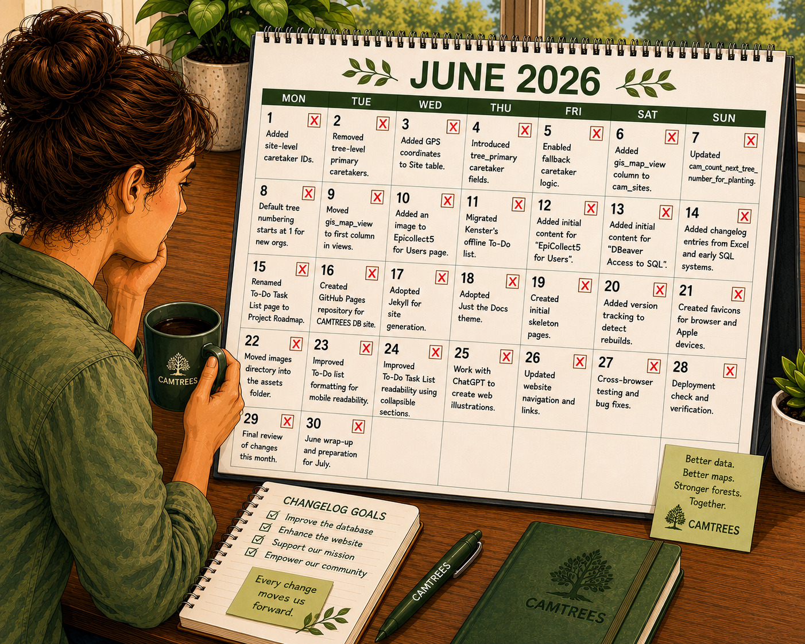

 ---
 title: Changelog
 layout: default
 nav_order: 98
 ---
 
 
 
 # {{ page.title }}
 _Version: October 8 edit # 1_
 
 <!-- This content will not appear in the rendered Markdown 
 

 
<strong>YYYY Month</strong>

 
 ### Area (EpiCollect / GitHub / Python / SQL / Website)
 ### EpiCollect
 ### GitHub
 ### Google Map
 ### Python
 ### SQL
 ### SQL Functions
 ### SQL Hosting
 ### SQL Tables
 ### SQL Views
 ### Website Content
 ### Website Infrastructure
 
 - Change/Impact/Notes
 
 Note:
 
 - Each entry should be mostly immutable once published.
 - New entries should be appended at the top of each section.
 - Keep descriptions short, factual, and action-oriented.
 
 

 -->
 
 This changelog documents updates to the CAMTREES Database, and its supporting systems:
 EpiCollect, GitHub, Google, Python, SQL, and this website.
 Each entry is grouped by month. Within each month, changes are organized by area.
 
 ---
 
 ## Changelog Entries
 
 ---
 
 

 
<strong>2026 October</strong>

 
 ### Website Content
 - Added CAM Volunteer Database table with Encrypted sensitive data
 
 

 
 ---
 
 

 
<strong>2026 September</strong>

 
 ### EpiCollect
 - Created new *CAM Chestnut Chasers* project
 
 ### GitHub
 - Added GitHub Action (Nightly-Maintenance.yml) to Import EpiCollect data, Update tree
 elevations, and export JSON files used by the website Database Tables
 
 ### Google Map
 - Deleted *CAM Trees Locations* Google Map - same service now provided by the Database Tables in this website
 
 ### Python
 - Moved all code from 'codebase' repository to 'camtrees.github.io' repository
 
 ### Website Content
 - Database Tables landing page indicates tables are in *live production* mode
 - Bigger colored buttons in the Database Tables
 - Added New Data Requests section under the CAM Staff Pages
 - Changed column sorting algorithm for all Database Tables
 - Add dropdown filters to Database Tables
 - Used QGIS Mac app to reposition hub-areas.geojson Hub Boundaries used for Database Tables
 - Swapped Latitude and Longitude in all Database Tables
 - Added Goolge Map and Apple Map to CAM Trees Database Table
 - Added Print Record button to the Record Details Database Tables Popup window
 - Added Encrypted columns capability to Database Tables

 

 
 ---
 
 

 
<strong>2026 August</strong>

 
 ### EpiCollect
 - Added "Cataloochie #273, Maggie Valley, NC" parent tree to mother and father questions
 
 ### SQL Tables
 - Added Chadbourne Field tree data for data not collected using "EpiCollect"
 
 ### Website Content
 - Added a Proposed Tree Tagging System for sharing with Mark, Eva, Lea, and Kim
 - Used ChatGPT to re-write pages
 - Added the CAMTREES Entity Relationship Diagram and table description to the PostGreSQL page
 - Added SQL Tables, Views, and Functions to the PostGreSQL page
 - Created new 'Database Tables' section
 - Created a 'CAM Trees' SQL Table under the 'Database Tables' website section
 - Added CAM Hubs, CAM Orgs, CAM Sites, Parent Trees, Site Visit, and Site in Hubs tables to the Database Table hierarchy
 - Added 'Map filtered ...' buttons to the CAM Hubs, CAM Sites, and CAM Trees Database Tables
 - Standardize pin types (circle, square, triangle) across all maps
 - Added Hub column to the CAM Sites Database Table
 - Add 'Hub Areas' Overlay to CAM Hubs, CAM Sites, and CAM Trees maps
 - Added Town column to the CAM Trees Database Table
 - Expanded columns shown when clicking a pin on the CAM Sites map.
 - Added user-location control to CAM Hubs, CAM Sites, and CAM Trees maps just under the zoom in and zoom out control
 
 

 
 ---
 
 

 
<strong>2026 July</strong>

 
 ### EpiCollect
 - Created HKR Tree TAG test project for possible use by Tree-Managers
 
 ### GitHub
 - Add Python PyCharm Project to camtrees.github.io repository
 - Created new camtrees/codebase to house SQL and Python source code
 
 ### Google Map
 - Added each trees height in inches and in human readable form (ft and inches)
 
 ### Python
 - Using .env file to keep SQL and EpiCollect Connection Parameters and Access Tokens secret
 - Add capability to use either the Neon CAMTREES master database or the KENSTER backup database
 - Move non-secret globals from .env file into new config.py file
 
 ### SQL Views
 - Created cam_tree_latest_height view
 
 ### Website Content
 - Created content for the GitHub page under the Info for Database Admins hierarchy
 - Created content for the 'PostgreSQL' page under the Info for Database Admins hierarchy
 
 

 
 ---
 
 

 
<strong>2026 June</strong>

 
 ### EpiCollect
 - Edit CLEW - Franklin Park tree numbers 100 and 200 to be 006 and 005
 - Add "Collect LIVE Data? Just TESTING?" question for WildCAM and WildTACF trees
 
 ### Python
 - Allow for specification of EpiCollect MAP_INDEX when retrieving data
 - Changes necessitated by removal of location_note from SQL tables_
 - Call sql_add_tree_initial_health function to set health of newly planted tree to 'good'
 
 ### SQL Hosting
 - Master CAMTREES Database is now under the CamOrgDatabase@gmail.com Neon User
 
 ### SQL Functions
 - Coded sql_add_tree_initial_health function to allow setting of newly planted tree
 
 ### SQL Tables
 - Worked with Marc to get MAFP - Field NE of Building Site data imported from EpiCollect
 - Remove location_note column; move existing data into access_note column
 
 ### SQL Views
 - Added cam_export_volunteer_email_for_epicollect
 - Added cam_export_tree_parent_type_for_epicollect
 - Renamed many "cam_..." views to be "data_..."
 
 ### Website Content
 - Created the Using ChatGPT to Create WebSite Illustrations web page
 - Created content for the "Info for Database Admins" page
 - Created content for the "Google Services" page
 
 ### Website Infrastructure
 - Added Database Admin skeleton pages for EpiCollect, GitHub, PostgreSQL, Python, etc
 - Added ChatGPT generated website illustrations
 - Project Roadmap now listed with Major Headers as Timeline and Sub Headers as Task Category
 - Added more ChatGPT Illustrations and resized all for consistency
 - Added Info for Database Users section
 
 

 
 ---
 
 

 
<strong>2026 May</strong>

 
 ### SQL Tables
 - Added site-level caretaker IDs
 - Removed tree-level primary caretakers in favor of site-level defaults
 - Added GPS coordinates to Site table for mapping support
 - Introduced `tree_primary_caretaker` and `tree_secondary_caretaker` fields
 - Enabled fallback caretaker logic in `cam_trees` view
 
 ### SQL Views
 - Added `gis_map_view` column to `cam_sites`
 - Updated `cam_count_next_tree_number_for_planting` to include all CAM orgs
 - Default tree numbering now starts at 1 for new orgs
 - Moved `gis_map_view` to the first column in `cam_sites` and `cam_trees` views to simplify map selection
 
 ### Website Content
 - Added an image to the Epicollect5 for Users page
 - Migrated Kenster’s offline To-Do list into the website
 - Added initial content for “EpiCollect5 for Users”
 - Added initial content for “DBeaver Access to SQL”
 - Added changelog entries previously stored in Excel and early SQL systems
 
 ### Website Infrastructure
 - Renamed To-Do Task List page to Project Roadmap
 - Created GitHub Pages repository for CAMTREES Database site
 - Adopted <a href="https://jekyllrb.com" target="_blank">Jekyll</a> for site generation
 - Adopted the <a href="https://just-the-docs.com" target="_blank">Just the Docs</a> theme
 - Created initial skeleton pages
 - Added version tracking to detect rebuilds
 - Created favicons for browser and Apple devices
 - Moved images directory into the assets folder
 - Improved To-Do list formatting for mobile readability
 - Improved To-Do Task List readability using collapsible sections, removing the need for numbering
 
 

 
 ---
 
 

 
<strong>2026 April</strong>

 
 ### GitHub
 - Added workflow to sync CAMTREES Neon database between accounts
 - Created GitHub account (camorgdatabase@gmail.com)
 
 ### SQL Tables
 - Added four `access_` columns to `tree`; updated `cam_trees` and dependent views
 - Removed Waldoboro hub
 - Added two new 2026 sites with associated data
 
 

 
 ---
 
 

 
<strong>2026 March</strong>

 
 ### SQL Tables
 - Added Eva Butler’s tree, site, and volunteer data
 - Renamed Augusta hub to Winthrop; added Danforth hub
 - Added two New Hampshire hubs
 
 ### SQL Views
 - Created `missing_data_` views
 
 

 
 ---
 
 

 
<strong>2026 February</strong>

 
 ### SQL
 - Added `date_created` and `date_updated` fields (initialized to 2026-02-01)
 - Created function for EpiCollect ALL records
 - Added `camtress_manage_dates` for automated timestamp handling
 - Added Mark McCollough tree data
 - Settled upon using Neon.com to host the CAMTREES Database (PostGreSQL)
 
 

 
 ---
 
 

 
<strong>2026 January</strong>

 
 ### SQL
 - Investigate PostGreSQL host platforms
 - Settled upon using PostGreSQL as the RDBMS
 
 

 
 ---
 
 

 
<strong>2025 December</strong>

 
 ### SQL
 - Brainstormed how to convert Excel system into SQL
 - Research various SQL Relational DataBase Management Systems (RDBMS)
 
 

 
 ---
 
 

 
<strong>2025 November</strong>

 
 ### EpiCollect
 - Updated “Cam Org – Site” question format
 - Enabled Rain Event entry by Hub or Site
 
 ### SQL Tables
 - Added Volunteer Interests table
 - Began migration from Excel to PostgreSQL
 
 

 
 ---
 
 

 
<strong>2025 October</strong>

 
 ### EpiCollect
 - Added additional GPS/tree-number screens
 - Simplified GPS record fields
 
 ### Excel
 - Added Lea’s 2025 planting data
 - Enabled WildCAM trees
 
 

 
 ---
 
 

 
<strong>2025 September</strong>

 
 ### Excel
 - Added watering data from Maggie Lynn's spreadsheet
 
 

 
 ---
 
