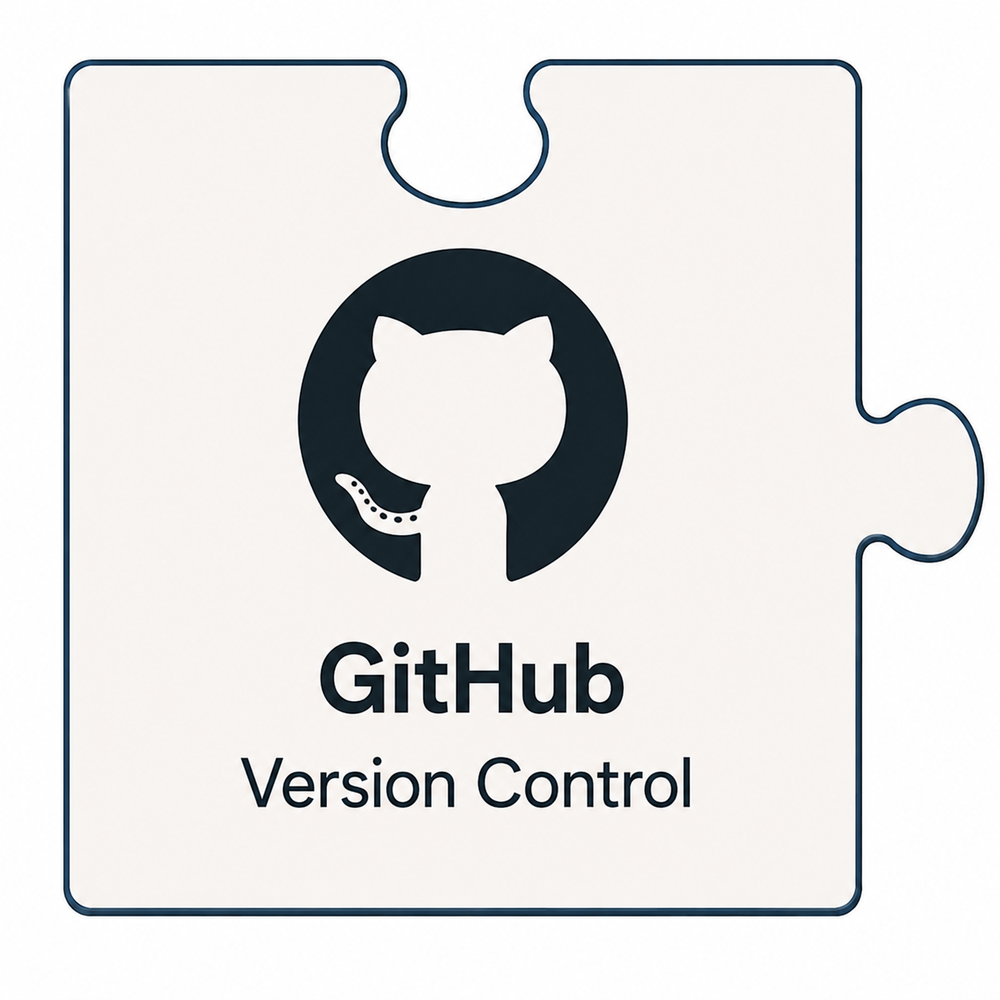

<table border="0" cellpadding="10">
  <tr>
    <td valign="top">
		
    </td>
    <td valign="center">
      
<h2>CAMTREES Database and GitHub</h2>

    </td>
  </tr>
</table>

# {{ page.title }}

<a href="https://github.com" target="_blank">GitHub</a>
is a cloud-based platform used to store, manage, and collaborate on software projects and
other digital resources using the Git version control system.

Projects are organized into **repositories**. A repository is a centralized location where
files are stored, changes are tracked, and previous versions can be reviewed or restored
when needed.

The CAMTREES GitHub account currently contains three repositories:

---

## Repository #1: `camtrees/camtrees.github.io`

This repository contains the source files used to create and maintain this CAMTREES
Database website.

The website is hosted using
<a href="https://docs.github.com/en/pages" target="_blank">GitHub Pages</a>,
GitHub's built-in hosting service for static websites. Website updates are published
automatically whenever changes are committed and pushed to the repository.

Behind the scenes, GitHub Pages uses
<a href="https://jekyllrb.com/docs/github-pages/" target="_blank">Jekyll</a>,
a static site generator that converts the website's source files into the finished pages
displayed by visitors.

The CAMTREES website uses the
<a href="https://just-the-docs.com" target="_blank">Just the Docs</a>
theme, which provides a clean, organized layout that works well on both desktop computers
and mobile devices.

---

## Repository #2: `camtrees/github-actions`

This repository contains the
<a href="https://github.com/features/actions" target="_blank">GitHub Actions</a>
used to automate CAMTREES maintenance tasks.

Currently, there is one active workflow:

**Create Neon Twin**

This workflow runs nightly at 2:00 AM and creates a backup copy of the CAMTREES PostgreSQL
database hosted by
<a href="https://neon.com" target="_blank">Neon</a>.
The name "Create Neon Twin" refers to the creation of this duplicate database copy.

Future GitHub Actions may automate additional tasks, including importing EpiCollect data
into the CAMTREES Database.

Currently, the EpiCollect import process requires running Python programs manually on the
database administrator's computer. Once these processes are converted into GitHub Actions,
they could be initiated remotely through GitHub rather than requiring direct access to a
local computer.

---

## Repository #3: `camtrees/codebase`

This repository contains the source code used to create and maintain the CAMTREES Database.

It includes:

- SQL code used to create and modify database tables.
- SQL views, functions, and triggers.
- Python programs used to import EpiCollect data into PostgreSQL.

To ensure the database remains accurate and reproducible, database administrators should
update the SQL source files first and then execute the updated code against the CAMTREES
Database using an SQL management tool.

The Python import programs require access credentials for both EpiCollect and the CAMTREES
Database hosted by Neon. These credentials are stored separately from the source code in a
private `.env` file.

Once these Python programs are converted into GitHub Actions, the required credentials
will be stored securely as encrypted GitHub Secrets.

Until that transition occurs, the `.env` file remains private and is accessible only to
authorized CAM staff members who also manage the project's shared cloud accounts.

---

## Recommended Method for Editing GitHub Files

Although GitHub files can be edited directly through the GitHub website, most
administrators will find it easier to work with files locally using 
<a href="https://docs.github.com/en/desktop/overview/about-github-desktop" target="_blank">GitHub Desktop</a>.

The typical workflow is:

1. Clone the GitHub repository to your local computer.
2. Edit the files using your preferred editor.
3. Commit the changes.
4. Push the changes back to GitHub.

This workflow is especially useful for maintaining the CAMTREES website. After website
files are pushed back to GitHub, GitHub Pages automatically rebuilds and publishes the
updated website within a few minutes.