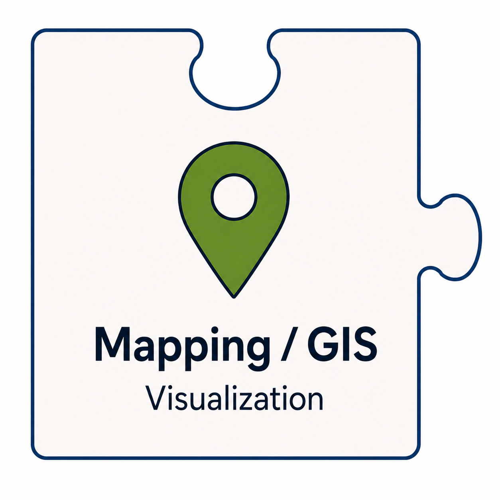
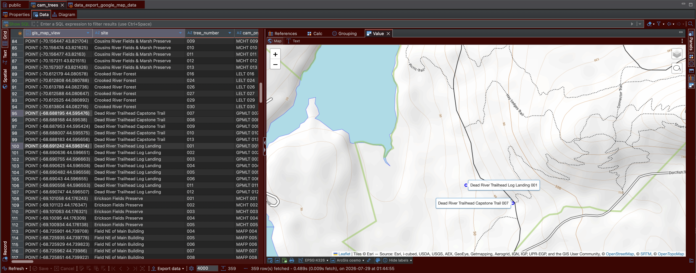

<center>
<table border="0" cellpadding="10">
  <tr>
    <td valign="top">
		
    </td>
    <td valign="center">
      <center><h2>CAMTREES<br>Database<br>and<br>Mapping/GIS</h2></center>
    </td>
  </tr>
</table>
</center>


# {{ page.title }}

## Viewing Tree Locations on a Map

The CAMTREES Database currently provides two ways to view tree locations on a map:

- **Custom Google My Maps** – Available to anyone with the map link.
- **DBeaver** – Our recommended desktop database tool, available to authorized CAM staff and volunteers.

---

## Using a Custom Google My Maps

The Google My Maps version of the map is created in three steps:

1. Create an SQL view containing each tree's latitude and longitude. Google uses these
coordinates to place a marker for every tree. When a user selects a marker, an information
card displays the tree's title, description, and any additional fields included in the SQL
view.

2. Export the SQL view to a local CSV file.

3. Import the CSV file into the custom Google My Maps project, replacing the existing tree
data.

You can view the
<a href="https://www.google.com/maps/d/edit?mid=1BnudQOUMWyFeMCpp1HV90hQPCFrWSx0&ll=44.44387186421211%2C-70.31670421000621&z=9" target="_blank">CAM Tree Locations</a>
map to see the locations of all chestnut trees planted by CAM to date.

---

## Using DBeaver

DBeaver can display tree locations directly from the PostgreSQL database using the PostGIS
extension.

The process consists of three steps:

1. Install the PostgreSQL **PostGIS** extension. PostGIS adds geographic data types and
mapping capabilities to PostgreSQL.

2. As each tree is added to the database, calculate and store a geographic point
representing its location on the Earth's surface.

3. From an SQL query or view, select one or more geography points. DBeaver automatically
plots the selected trees on an interactive map in its **Value** panel.

---

## Example: Viewing Trees in DBeaver

The screenshot below shows two selected trees (rows **95** and **100**). Because only
those two rows are selected, only those two tree locations are displayed on the map.

<a href="../assets/images/website/dbeaver_tree_map.png" target="_blank"></a>

*Click the image to view the full-size version in a new browser tab.*

---

## Creating a Geography Point for Each Tree

When a new tree is added to the **tree** table, PostgreSQL automatically calculates and
stores a geographic point using the tree's longitude and latitude.

The following excerpt from the `tree` table definition shows how this is accomplished:

```sql
CREATE TABLE tree (
    id        INTEGER GENERATED ALWAYS AS IDENTITY PRIMARY KEY,
    longitude float8,
    latitude  float8,
    geog      geography(Point, 4326)
              GENERATED ALWAYS AS (
                  ST_SetSRID(ST_MakePoint(longitude, latitude), 4326)::geography
              ) STORED,
    ...
);
```

---

## Understanding the Geography Column

### `geog`

The name of the column that stores each tree's geographic location.

### `geography(Point, 4326)`

Defines the column as a geographic point using the **WGS 84** GPS coordinate system (SRID
4326).

### `GENERATED ALWAYS AS (...) STORED`

Tells PostgreSQL to calculate the geography point automatically whenever the tree's
longitude or latitude changes and then permanently store the calculated value in the
table.

### `ST_SetSRID(ST_MakePoint(longitude, latitude), 4326)`

Creates a point from the longitude and latitude values and assigns the correct spatial
reference identifier (SRID 4326).

### `::geography`

Converts the point into PostgreSQL's **geography** data type, allowing distances and other
spatial calculations to be performed using the Earth's curved surface rather than a flat
plane.

---

## Additional Notes

### Geography vs. Geometry

The **geography** data type performs calculations using the Earth's curved surface,
producing accurate real-world distances measured in meters.

The **geometry** data type, which is not used by CAMTREES, treats coordinates as though
they exist on a flat surface. While geometry is often faster, geography provides more
accurate distance calculations for GPS coordinates.

### What Is SRID 4326?

**SRID 4326** identifies the **WGS 84** coordinate system, the worldwide standard used by
GPS devices. Coordinates are stored as latitude and longitude values measured in degrees.

### Why Use `STORED`?

The `STORED` keyword tells PostgreSQL to save the calculated geography point on disk
instead of recalculating it every time it is needed.

Although this uses a very small amount of additional storage, it significantly improves
the performance of spatial queries and map displays.
