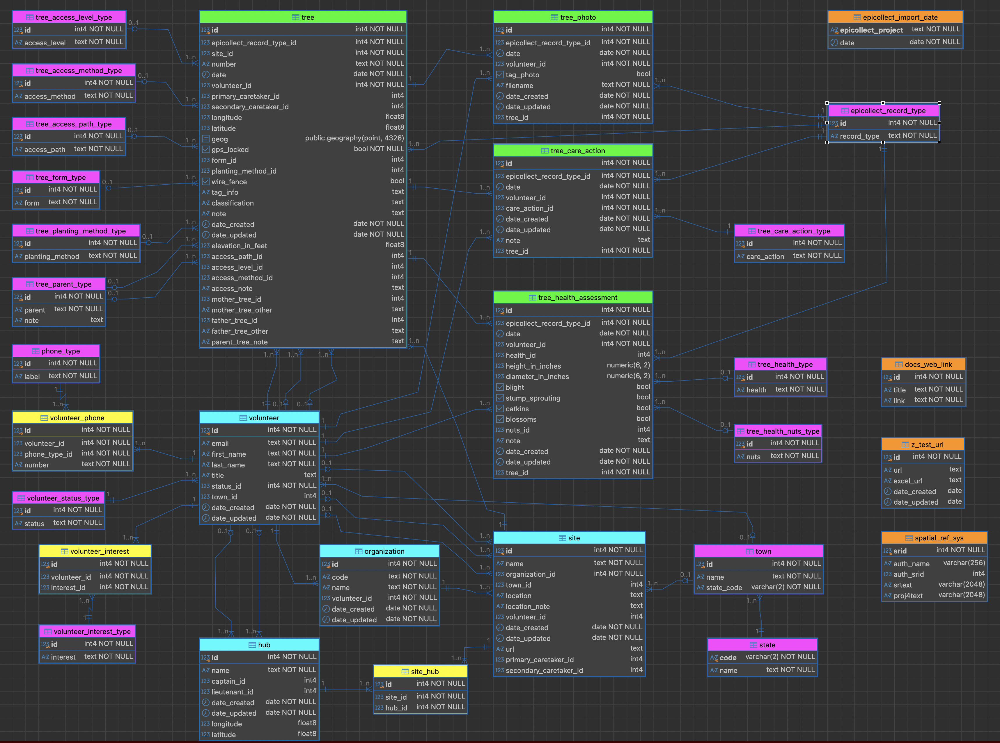

<table border="0" cellpadding="10">
  <tr>
    <td valign="top">
		
    </td>
    <td valign="center">
      
<h2>CAMTREES Database and PostgreSQL</h2>

    </td>
  </tr>
</table>

# {{ page.title }}

We store the CAMTREES Database in **PostgreSQL**, a powerful, open-source (free)
relational database management system (RDBMS). PostgreSQL is well known for its
reliability, standards compliance, and extensibility, making it an excellent choice for
applications that require accurate, long-term data management.

Although PostgreSQL itself is free to use, the database must be hosted on a server that is
accessible over the Internet. Because Chestnuts Across Maine (CAM) is a nonprofit
organization with limited financial resources, we wanted a hosting solution that was
either free or very affordable.

## Neon.com

The CAMTREES Database is hosted by <a href="https://neon.com" target="_blank">Neon</a>, a
cloud-based PostgreSQL hosting service.

Neon uses a usage-based pricing model with no monthly minimum charge and offers a generous
Free Tier. The Free Tier is currently more than sufficient for the size and activity level
of the CAMTREES Database.

If our storage or usage requirements increase in the future, upgrading to a paid plan is
straightforward, with expected hosting costs remaining relatively low – likely in the range
of $5 to $10 per month.

## CAMTREES Database Schema

### Entity Relationship Diagram

*Click the image to view the full-size version in a new browser tab.*

### SQL Tables

The color of the SQL tables' headers in the ER Diagram indicates the type and purpose of the tables.

<strong>Green Tables — The four main tables containing tree related data</strong>

* **tree** — All the CAM planted trees or Wild trees under observation
* **tree_photo** — Photos of the trees. The actual photos are stored in EpiCollect. We compute the URL necessary to view the tree. NOTE: You MUST BE LOGGED INTO EpiCOllect to view the photos.
* **tree_care_action** — Care actions performed on trees
* **tree_health_assessment** — Tree measurements and observations to assess the health of the tree

<strong>Cyan Tables — Organizational tables</strong>

These tables are also Lookup Tables

* **hub** — Hub regions as defined by Eva Butler
* **organization** — Cam Organizations
* **site** — Sites where trees are planted
* **volunteer** — Volunteers. All persons referenced in any table will appear in this table.

<strong>Yellow Tables — SQL join tables</strong>

* **site_hub** — Sites contained in each hub
* **volunteer_interest** — Volunteer's interests. Like watering trees or being available for special events.
* **volunteer_phone** — Phone numbers at which volunteers can be reached

<strong>Purple Tables — Lookup tables that link to a other tables via a foreign key relationship</strong>

* **epicollect_record_type** — EpiCollect record types (path the volunteer takes trhough the iPhone app)
* **phone_type** — Phone Type (home, cell, work, etc)
* **state** — State codes plus Washing D.C.
* **town** — All towns in Maine with a few towns from other states
* **tree_access_level_type** — Ease of access for trees
* **tree_access_method_type** — Access method to pollinate or harves trees
* **tree_access_path_type** — Access path to a tree
* **tree_care_action_type** — Care actions (water, weed, fertilize, prune)
* **tree_form_type** — Tree shape (straight, bushy)
* **tree_health_nuts_type** — Nut quantity produced by the tree
* **tree_health_type** — Tree health (good, poor, dead)
* **tree_parent_type** — Mother and Father Trees
* **tree_planting_method_type** — Tube (if any) used to plant the tree
* **volunteer_interest_type** — Volunteer interests
* **volunteer_status_type** — Volunteer status (active, inactive, etc)

<strong>Orange Tables — Independent tables not linked to any other tables</strong>

* **docs_web_link** — Helpful web links
* **epicollect_import_date** — Epicollect Import Dates from running Python programs
* **spatial_ref_sys** — A PostGIS table used for plotting trees on a map
* **z_test_url** — Test table for Kenster to experiment with URL's and their clickability

### SQL Views

<strong>'Earliest' and 'Latest' Views</strong>

* **cam_tree_latest_health** - Show latest tree_health
* **cam_tree_latest_height** - Show latest tree_height
* **cam_tree_latest_water** - Show most recent date trees have been watered
* **cam_tree_photos_earliest_photos** - Show all photos from the first date on which a tree had any photos taken
* **cam_tree_photos_latest_photos** - Show all photos from the latest date on which a tree had any photos taken

<strong>'CAM' Views - Views for which CAM Staff will be most interested</strong>

* **cam_hubs** - Hub regions as defined by Eva Butler
* **cam_organizations** - Cam Organizations
* **cam_sites** - Sites where trees are planted
* **cam_sites_hubs** - Sites contained in each hub
* **cam_towns_with_state_name** - All towns in Maine with a few towns from other states
* **cam_tree_care_action** - Care actions performed on trees
* **cam_tree_health_assessment** - Tree size and health measurements
* **cam_tree_photos** - Photos of the trees. The actual photos are stored in EpiCollect. We compute the URL necessary to view the tree. NOTE: You MUST BE LOGGED INTO EpiCOllect to view the photos.
* **cam_tree_photos_with_tags** - Tree photos showing a closeup of the tree's tag
* **cam_tree_photos_without_tags** - Tree photos excluding photos of the tree's tags
* **cam_trees** - CAM planted trees or Wild trees under observation
* **cam_volunteer_interests** - Volunteer's interests. Like watering trees or being available for special events.
* **cam_volunteer_phone_numbers** - Phone numbers at which volunteers can be reached
* **cam_volunteers** - Volunteers. All persons referenced in any table must appear in this table.

<strong>'Count' Views - Frequency counts of various values</strong>

* **data_count_next_tree_number_for_planting** - Show the NEXT CamOrg tree number to be used when planting new trees
* **data_count_tree_care_action_by_volunteer** - Frequency count of how many times volunteers have attended to trees by type of care_action
* **data_count_trees_by_health** - Frequency count of trees by the tree health
* **data_count_trees_by_primary_caretaker** - Frequency count of how many trees each primary caretaker is responsible for
* **data_count_trees_by_site** - Frequency count of how many trees are at each site

<strong>'Crosstab' Views - Statistical tables that display the relationship between two or more categorical variable</strong>

* **data_crosstab_care_action_by_record_type** - Crosstab of Tree Care Action BY EpiCollect Record Type
* **data_crosstab_site_by_hub** - Crosstab of Site BY hub
* **data_crosstab_tree_planting_method_by_wire_fence** - Crosstab of Tree Planting Method BY Wire Fence

<strong>'Distance' Views - Shows the distance between trees</strong>

* **data_distance_between_all_trees** - Show tree to tree distance (in meters and miles) for all trees
* **data_distance_between_trees_at_same_site** - Show tree to tree distance (in meters and feet) but only for trees at the same site
* **data_distance_trees_within_15_meters_of_each_other** - Show tree to tree distance (in meters and feet) for all trees within 15 meters of each other

<strong>'Duplicate' Views - Duplicate records in tables</strong>

* **data_duplicate_tree_care_actions** - Duplicate tree_care_action records (if any)
* **data_duplicate_tree_health_assessments** - Duplicate tree_health_assessments records (if any)

<strong>'Error' Views - Tables with missing data</strong>

* **data_error_hubs_with_no_captain** - Hubs with no captain (If any)
* **data_error_hubs_with_no_sites** - Hubs not linked to any sites
* **data_error_sites_in_multiple_hubs** - Sites in more than one hub
* **data_error_sites_not_in_any_hub** - Sites not linked to any hubs
* **data_error_sites_with_no_contact** - Sites with no contact person
* **data_error_sites_with_no_primary_caretaker** - Sites with no primary caretaker
* **data_error_sites_with_no_site_url** - Sites with no URL
* **data_error_sites_with_no_trees** - Sites with no trees
* **data_error_trees_with_gps_approximated** - Trees with estimated longitude and latitude data
* **data_error_trees_with_no_elevation** - Trees with missing elevation
* **data_error_trees_with_no_gps** - Trees with missing longitude and latitude data
* **data_error_trees_with_no_mother_or_father** - Trees with missing parents
* **data_error_trees_with_no_primary_caretaker** - Trees with no primary caretaker
* **data_error_trees_with_no_tag_info** - Trees with no tag_info
* **data_error_trees_with_no_tag_photo** - Trees with missing tag photo
* **data_error_trees_with_planting_method_unknown** - Trees with unknown planting method
* **data_error_volunteers_with_no_email** - Volunteers with temporary (non-valid) email addresses
* **data_error_volunteers_with_no_hometown** - Volunteers with no home town
* **data_error_volunteers_with_no_phone** - Volunteers with no known phone number

<strong>'Export' Views - For exporting data to EpiCollect or Google Maps</strong>

* **data_export_epicollect_tree_parent_type** - Export tree_parent_type as CSV file to load into EpiCollect CAM Tree Maintenance form
* **data_export_epicollect_volunteer_email** - Export volunteer_email as CSV file to load into EpiCollect CAM Tree Maintenance form
* **data_export_google_map_data** - Export Google Map Data as CSV file and load into Google Maps

<strong>'Site Visit' Views - Useful for printing prior to a Site visit</strong>

* **data_site_visit** - Show data useful to have printed for when a volunteer performs a site visit

<strong>'Kenster' Views - Database Admin views</strong>

* **user_hkr_tree_photos_for_tag_info_editing** - Tree photos with our EpiCollect link and tag_info for easy Kenster editing

### SQL Functions

<strong>'Add' Functions - Called from Python to insert data into SQL tables</strong>

* **camtrees_add_care_action** - Add a tree_care_action from an EpiCollect 'ONE', 'ALL', or 'RAIN' record
* **camtrees_add_health_assessment** - Add a new tree_health_assessment from an EpiCollect ONE record
* **camtrees_add_tree_initial_health** - Add a new initial tree_health_assessment from EpiCollect 'PLANT' record
* **camtrees_add_tree_photo** - Add a new tree photo
* **camtrees_add_tree** - Add a new tree

<strong>'Count' Functions - Used by Views to count records in Tables and Views</strong>

* **camtrees_count_table_rows** - Assists with counting rows in Tables
* **camtrees_count_view_rows** - Assists with counting rows in Views

<strong>'Distance' Functions - Used by views to calculate tree distances</strong>

* **camtrees_get_distance_to_closest_wildcam_tree** - Get the distance (in meters) to the closest WildCAM tree

<strong>'Date' Functions - Add date_created and date_updated values to tables</strong>

* **camtrees_manage_dates** - Add a date_created on INSERT and date_updated on UPDATE

<strong>'Interrogate' Functions - Called from Python to test certain conditions</strong>

* **camtrees_tree_exists** - Determine if a tree already exists in the 'tree' table
* **camtrees_tree_gps_locked** - Get tree's gps_locked value

<strong>'Update' Functions - Called from Python to Update tree column values</strong>

* **camtrees_update_access_method** - Update a tree's access_method
* **camtrees_update_tree_form** - Update a tree's form
* **camtrees_update_tree_gps** - Update a tree's GPS data. Append new access_note data to existing access_note

