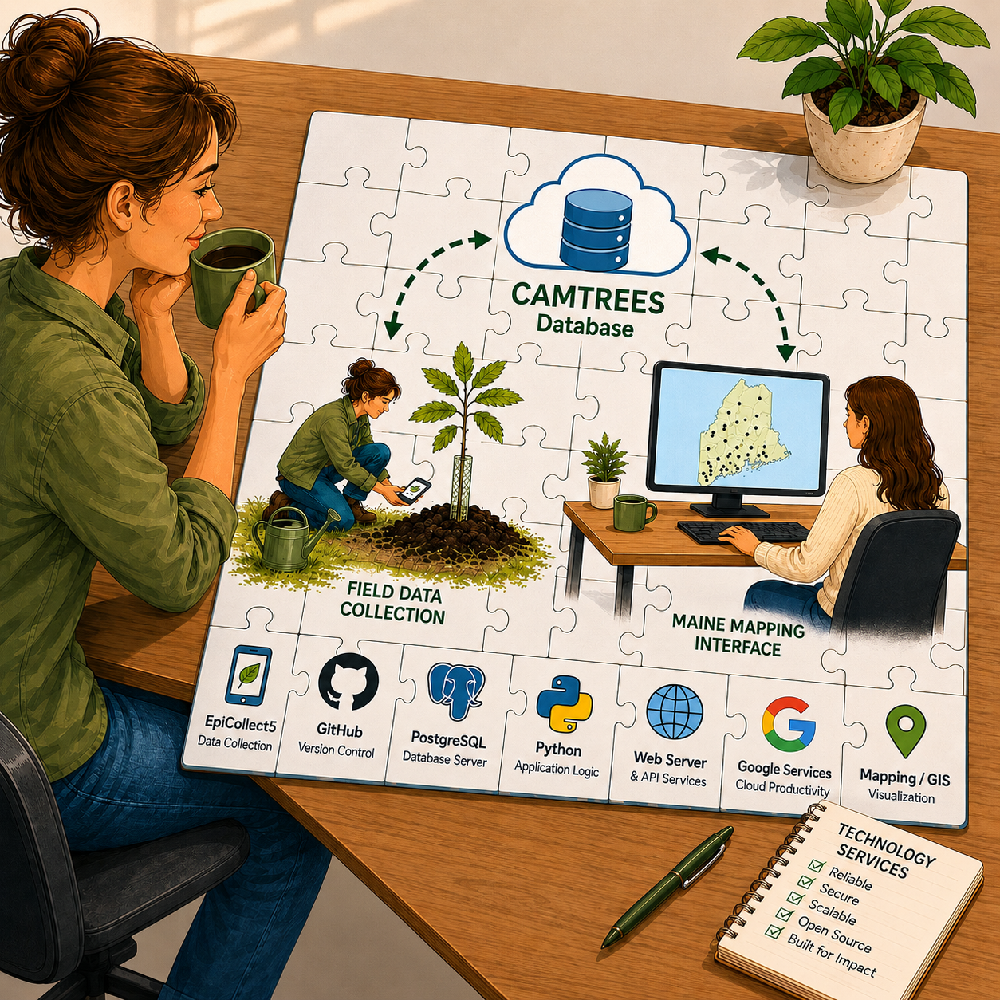

# {{ page.title }}

As illustrated by the jigsaw puzzle above, the CAMTREES Database is built from several
cloud services and open-source technologies that work together as a single technology
ecosystem.

- **EpiCollect5**
	* Used by volunteers to collect tree data in the field.
	* Also used by Hub Captains to record rainfall events.
- **GitHub**
	* Hosts the source code and documentation for the CAMTREES project.
	* GitHub Actions automatically perform a nightly backup of the CAMTREES Database.
	* GitHub Pages hosts this website.
- **PostgreSQL**
	* Serves as the primary relational database for the CAMTREES project.
	* The database is hosted by Neon, a cloud-based PostgreSQL hosting service.
- **Python**
	* Python programs import data collected by EpiCollect into the CAMTREES Database
	* Development is performed using the PyCharm integrated development environment (IDE)
- **Web Server**
	* GitHub Pages hosts this website.
- **Google Services**
	* Gmail provides the shared account used to access the project's cloud services.
	* Google Groups provides a shared email address and facilitates collaboration among volunteers.
	* Google My Maps allows us to create a custom map showing CAM Tree Locations across Maine.
- **Mapping / GIS**
	* PostGIS extends PostgreSQL by adding support for showing data on maps, as well as 
	  querying geospatial data.
	* Google My Maps provides a publicly accessible map of CAM tree locations across Maine.
	* DBeaver allows database administrators to display selected tree locations directly from the database.

Additional information about each of these technologies is available throughout the Info
for Database Admins section of this website.

