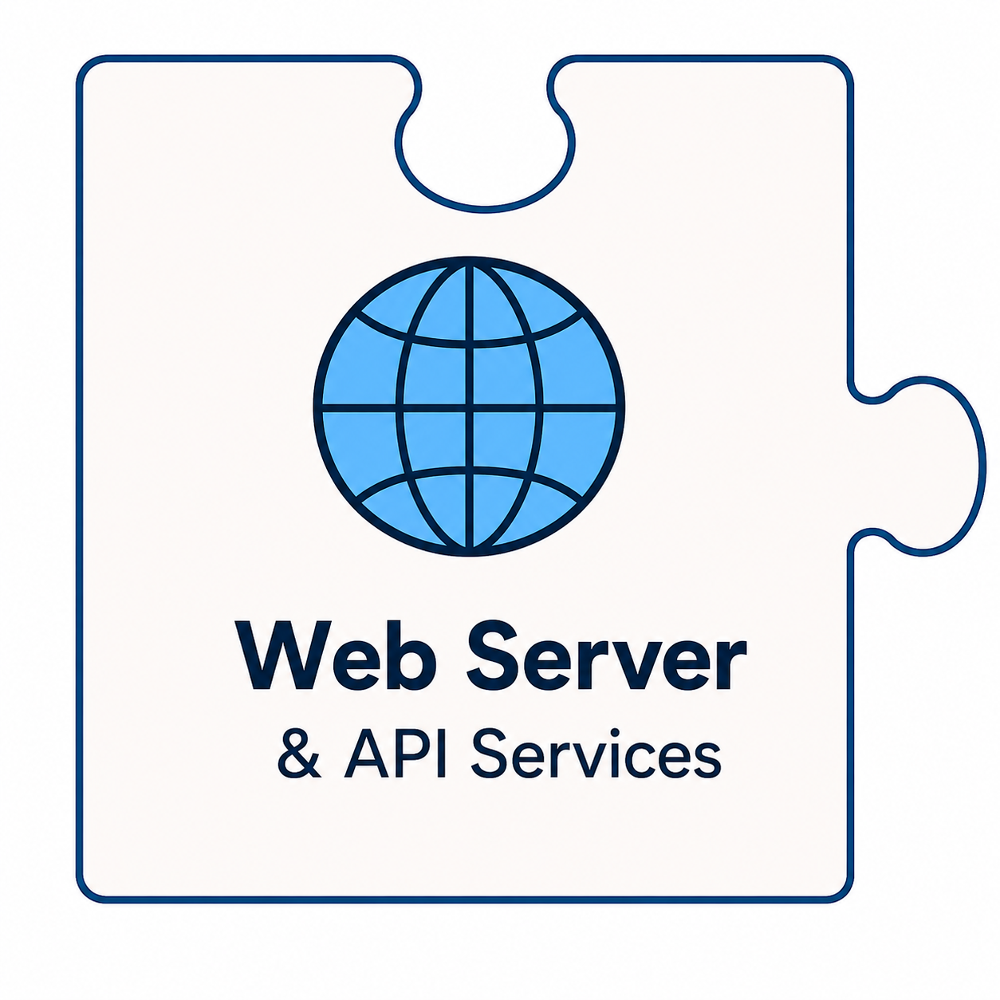

<table border="0" cellpadding="10">
  <tr>
    <td valign="top">
		
    </td>
    <td valign="center">
      
<h2>CAMTREES Database and Web Server</h2>

    </td>
  </tr>
</table>

# {{ page.title }}

## GitHub Pages

The CAMTREES Database website is hosted using
<a href="https://docs.github.com/en/pages" target="_blank">GitHub Pages</a>,
GitHub's built-in hosting service for static websites.

One of the advantages of GitHub Pages is its seamless integration with GitHub. Updating
the website is as simple as committing changes to the repository and performing a standard
`git push`.

## Jekyll and the Just the Docs Theme

Behind the scenes, GitHub Pages uses
<a href="https://jekyllrb.com/docs/github-pages/" target="_blank">Jekyll</a>,
a static site generator that transforms the website's source files into the finished pages
visitors see in their web browser.

Jekyll supports a variety of community-developed themes that control a website's
appearance and navigation. The CAMTREES Database website uses the
<a href="https://just-the-docs.com" target="_blank">Just the Docs</a>
theme, which provides a clean, well-organized layout that works well on both desktop
computers and mobile devices.
