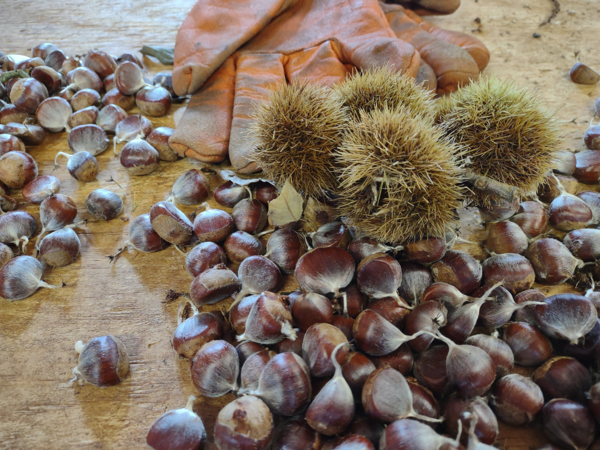

<table border="0" cellpadding="10">
  <tr>
    <!-- Image on the left -->
    <td valign="top">
      
    </td>
    <td valign="center">
      
<h2>Chestnuts Across Maine   CAMTREES Database</h2>

    </td>
  </tr>
</table>

For context of why the CAMTREES Database system exists you should know a little bit about the [Chestnuts Across Main Project](https://tacf.org/me/chestnuts-across-maine/). From their website, here is a short blurb about the Chestnuts Across Maine organization and their goals.

> Chestnuts Across Maine (CAM) is an exciting, new initiative of the Maine chapter of The American Chestnut Foundation (TACF). Our chapter is partnering with land trusts, state parks, schools, and town squares in Maine to establish small plantings of American chestnuts on lands open to the public. This is a long-term, multi-generational commitment that achieves many of the goals of TACF. Our vision is that by 2035 anyone who wishes to see a live American chestnut tree can find one less than an hour drive from home. We will see chestnut trees thriving within a 10 minute walk of every Maine school. We will establish a network of savvy and experienced conservation partners to help us to test the next blight tolerant chestnuts. We want to make it easy for TACF members to engage with chestnut restoration wherever they live in Maine. We intend to build communities around groves of chestnuts where Mainers will gather in common cause to benefit the ecological and social wealth of their communities.

In order to further the goals of the Chestnut Across Maine chapter we have created a CAMTREES Database system where volunteers collect tree data while in the field after which that data is fed into a database for further analysis and presentation.

This website will document everything it takes to accomplish this.

Version: 5