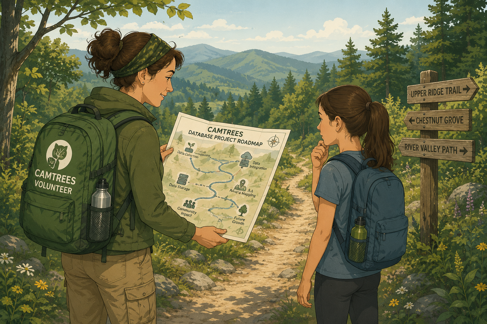

<!-- This content will not appear in the rendered Markdown 

Timeline Headers
-------------------------
## In Progress
## Coming Soon (1–2 months)
## Planned (3–6 months)
## On the Horizon (7–9 months)
## Future Vision (10–12 months)
## Exploring - Ideas & Possibilities (no estimated timeline)
## Ongoing (now and forever)

Groupings
-------------------------
EpiCollect
Python
SQL
Website

Collapsible Section Code
-------------------------

Grouping: Title

**Purpose:**
Short description.

**Tasks:**
* Item 1
* Item 2

**Notes:**
Additional details.

-->

# {{ page.title }}

{: .warning }
Roadmap items are listed in approximate priority order. Timing estimates may change as project needs evolve.

* * * * * * * * * * * * * * * * * * * * * * * * * * * * * * * * * * * * * * * * * * * * 

## Critical Fixes Required Now

NONE: No critical fixes required at this tim

**Purpose:**
Critical fixes will be listed here if needed

**Tasks:**
- None now

<!--------------------------------------------------------------------------------------->

* * * * * * * * * * * * * * * * * * * * * * * * * * * * * * * * * * * * * * * * * * * * 

## In Progress

SQL: Add additional 'missing_data' views

**Purpose:**
Will assist users to help fill gaps in the data.

**Tasks:**
- missing_data_trees_with_no_mother_or_father

<!--------------------------------------------------------------------------------------->

SQL: Document how CAM volunteers and staff can access the CAMTREES database using DBeaver

**Purpose:**
Plan to have a Zoom call to demo the use of DBeaver to access the Neon Read Replica
CAMTREES Database.

**Notes:**
Refer to the staff-dbeaver-access-to-SQL web page for details.

<!--------------------------------------------------------------------------------------->

Website: Document the process for adding a new CAMorgs, Sites, Hubs, Volunteers, etc

**CAM organization (CAMorg):**
- Code: The CAMorg abbreviation
- Name: The CAMorg name
- Contact Partner Person(s): The Volunteer Name(s)

**Sites:**
- Name: The Site name
- Camorg: The CAMorg that the Site is associated with
- Town: The town in which the Site is located
- Location: The street address of the Site (if any)
- Contact Person(s): The Volunteer Name
- URL: The site URL
- Primary_Caretaker: The primary caretaker for ALL the trees at the Site
- Secondary_Caretaker: The secondary caretaker for ALL the trees at the Site
- Hub: In what Hub is the Site contained

**Hubs:**
- Name: The Hub name
- Captain: The Hub captain
- Lieutenant: The Hub lieutenant

**Volunteers:**
- first_name: first name
- last_name: last name
- email: email address
- title: job title
- hometown: home Town
- phone numbers: cell, home, work, any and all
- Add the volunteer's email address to EpiCollect
	- Add all volunteers to the CAM Tree Maintenance project, even though some may never
	  use EpiCollect.
	- Add Hub Captains, Lieutenants, and select other volunteers to the
	  CAM Tree Rain Event project

<!--------------------------------------------------------------------------------------->

Website: Continue the build-out of the CAMTREES Database Website

**Purpose:**
Currently in the process of trying to document everything Ken Rosenberry (our current
database administrator and EpiCollect form designer) knows how to do to keep the
CAMTREES Database system running.

<!--------------------------------------------------------------------------------------->

* * * * * * * * * * * * * * * * * * * * * * * * * * * * * * * * * * * * * * * * * * * * 

## Coming Soon (1–2 months)

EpiCollect: Document how to get a list of volunteers with access

**Purpose:**
Volunteers MUST have access to EpiCollect to collect data in the field.

**Tasks:**
- Go to EpiCollect on the web and login
- Go to “My Projects”
- Click the ‘DETAILS’ button for the Tree Maintenance project
- Click ‘Manage Users’ in the left pane
- From the ‘Add’ drop down button (click the down arrow), select ‘Export users csv’
- From your Mac’s downloads folder, double-click the “cam-tree-maintenance_users.zip” file
- Look inside the extracted “cam-tree-maintenance_users” folder, and open the “all.csv” file

**Notes:**
- All SQL volunteers should have access to the EpiCollect CAM Tree Maintenance project.
- Hub Captains, Hub Lieutenants, and some select CAM staff should have access to the 
  EpiCollect CAM Tree Rain Event project.

<!--------------------------------------------------------------------------------------->

EpiCollect: Document how to add a  new 'CAMorg - Site' pair

**Purpose:**
Document adding a new CAMorg - Site both by hand as a single item and via CSV Import

**Tasks:**
- Will need to verify the default Data Map is what we expect

**Notes:**
Additional details.

<!--------------------------------------------------------------------------------------->

SQL: Allow CAMorgs, and Sites to have multiple contact persons

**Purpose:**
Allow each CAMorg and Site to have as many contact persons as necessary. 

**Tasks:**
- Add two new tables: contact_camorg and contact_site
- Will also need two new views since the tables will be mostly foreign key numbers

**Notes:**
We may need to have a contact_comment field for each CAMorg and Site contact person.
For example: say Mark McCollough is the contact person for the Fort Point State Park.
But he is away for some time. The comment might say: Mark is in Antarctica for the next
3 years so, until May of 2029, please reach out to other Fort Point State Park contacts.

**Additionally:**
- Once that capability is implemented, the following contact information should be added:
- An additional contact for the 'Meddybemps Lake Land Trust' CAMorg is:
	- Brittany Mauricette
- Additional contacts for the 'Maine Coast Heritage Trust' CAMorg may be:
	- Andrew Deci
	- Emily Marshall
- Additional contacts for the Mt Joy Community Orchard site are:
	- Eva Barinas eva@cultivatingcommunity.org
	- Silvan Shawe silvan@cultivatingcommunity.org
- Additional contact for the North Shore Preserve site is:
	- Jessie Hallowell jhallowell@nhcshawks.org
- Verify these contacts, as well as all other contact information, with Eva

<!--------------------------------------------------------------------------------------->

SQL: Create a view that shows the tree photos from the first and last visit each year

**Purpose:**
Would allow evaluation of trees at the beginning and end of a growing season.

**Notes:**
Perhaps use some SQL code something like:
EXTRACT(YEAR FROM CURRENT_DATE) and EXTRACT(YEAR FROM tree_photo.date table)

<!--------------------------------------------------------------------------------------->

SQL: Add views requested by CAM staff

**Purpose:**
Add views that could help CAM staff identify tree issues.

**Possible Views:**
- tree heights and diameter - with tree age, hub, and site
- trees in bloom - with hub and site
- trees producing nuts - with hub and site
- dead trees - with hub, site, and planting method
- last 5 dates trees received water
- sites by year added (this will necessitate creating a new column in the site table)

<!--------------------------------------------------------------------------------------->

Website: Get website input from Kim, Eva, Mark et al

**Purpose:**
Once this website is more complete, we will need to have CAM staff review it.

<!--------------------------------------------------------------------------------------->

* * * * * * * * * * * * * * * * * * * * * * * * * * * * * * * * * * * * * * * * * * * * 

## Planned (3–6 months)

SQL: Complete as much of the database missing data as possible

**Purpose:**
Work with CAM staff to review all the 'missing_data' views in SQL and try to fill in
as much of the missing data as possible.

<!--------------------------------------------------------------------------------------->

SQL: Check for inconsistent Plant Dates vs YYYY on Tag

**Purpose:**
Identify any discrepancies between the year a tree was plantee and the YYYY etched
into the tree's tag.

<!--------------------------------------------------------------------------------------->

SQL: Create a view that shows the proximity of dead and poor trees

**Purpose:**
Researchers could evaluate if location affects the tree health.

**Notes:**
Perhaps 3 views:
1. dead trees
1. poor trees
1. dead and poor trees combined

<!--------------------------------------------------------------------------------------->

* * * * * * * * * * * * * * * * * * * * * * * * * * * * * * * * * * * * * * * * * * * * 

## On the Horizon (7–9 months)

Python: Evaluate cloud-based solutions (such as GitHub Actions) for running Python scripts

**Purpose:**
The Python programs that import records from EpiCollect to the CAMTREES Database are
currently run on the database administrator's personal computer. This is quite undesirable
since it does not meet with having a good continuity plan in place for when personnel
change. 

**Tasks:**
- Could create a schedule for running programs automatically but maybe it would be
  better to have a human run the programs on demand.
- An undesirable fallback option to a cloud solution would be for a user to run
  the programs using PyCharm (or a similar environment) on their personal computer as
  is done now. 

<!--------------------------------------------------------------------------------------->

* * * * * * * * * * * * * * * * * * * * * * * * * * * * * * * * * * * * * * * * * * * * 

## Future Vision (10–12 months)

GitHub: Use GitHub as a long-term photo repository instead of EpiCollect

**Purpose:**
Would allow users to view photos outside a web browser without having to be logged into EpiCollect.

**Tasks:**
- This will require a Python program to download ALL existing photos and thumbnails.
- This will also require a mod to our Python import code so that photos are
  downloaded each time Tree Maintenance data is imported.
- Python code rewrites will be tricky if the Python code is stored as a GitHub action.
  This is due to GitHub Actions not having direct write access into a repository.

<!--------------------------------------------------------------------------------------->

* * * * * * * * * * * * * * * * * * * * * * * * * * * * * * * * * * * * * * * * * * * * 

## Exploring - Ideas & Possibilities (no estimated timeline)

SQL: CAM staff needs web access to the CAMTREES database

**Purpose:**
Having done a very short prototype using SoftR.io, we see just how useful a web interface
to the CAMTREES Database would be. So much cleaner and easier to use than DBeaver.

**Tasks:**
- Use softr.io? (NOT FREE)
	- Has really nice Mapping capabilities (but might cost more $ for Google maps!)
	- Has nice filtering capabilities of tables (dropdown menus or text filtering)
	- Quite easy to create a website in very little time
- Given $$ constraints, research these
	- <a href="https://www.nocobase.com/en/blog/6-no-code-tools-supporting-postgresql" target="_blank">6 Best No-Code Tools for PostgreSQL</a>
	- <a href="https://www.appsmith.com" target="_blank">Appsmith</a>
	- <a href="https://teable.ai" target="_blank">Teable</a>
	- <a href="https://www.youtube.com/watch?v=wE_Oafo1bx0_" target="_blank">UI Bakery</a>

<!--------------------------------------------------------------------------------------->

SQL: Selected CAM staff members should have controlled write access to database tables

**Purpose:**
CAM staff needs write access to some CAMTREES Database data.

**Tasks:**
- Would be most helpful to do this through a web browser versus DBeaver or any other
  database management tool.
	- CAM staff will not need to have DELETE capabilities. But they will need UPDATE
	  and possibly INSERT.
		- For example, marking a volunteer as 'inactive'
		- Changing (and removing) volunteers from the list of Hub Captains

**Notes:**
- This would likely require changing from using 'ken.rosenberry@gmail.com' Neon
  as the master to using the camorgdatabase@gmail.com as the master
	- We could then mirror the database from camorgdatabase to ken.rosenberry
  	  instead of our current method
- Need list of write access capabilities
	- Create new Volunteers, CAMorgs, Sites, Hubs
	- Update contact persons in CAMorgs and Sites
	- Update Hub captains and lieutenants
	- Update Volunteer info (names, email, phone numbers, hometown, status)

<!--------------------------------------------------------------------------------------->

SQL: List (or email) volunteers by Hub

**Purpose:**
Have a way to identify which volunteers are interested in activities BY Hub. And further,
a way to email only those volunteers interested in activities within a certain Hub.

**Tasks:**
* Email volunteers in specific hub(s)
* List volunteers (name, email, phone) by hub

**Notes:**
- We do not currently have a means to know or determine in which Hub a volunteer lives
  or has interest in.

<!--------------------------------------------------------------------------------------->

* * * * * * * * * * * * * * * * * * * * * * * * * * * * * * * * * * * * * * * * * * * * 

## Ongoing (now and forever)

Python: After Python Import code testing, delete test records created by the database administrator

**Purpose:**
The database administrator often creates test EpiCollect records when needing to test
modifications to the Python import code. Once testing is complete, test records imported
into the CAMTREES Database will need to be deleted from the following tables.

**Tables:**
- tree
- tree_photo
- tree_care_action
- tree_health_assessment

**Notes:**
It would be desirable to have an SQL function to delete the records.

<!--------------------------------------------------------------------------------------->

