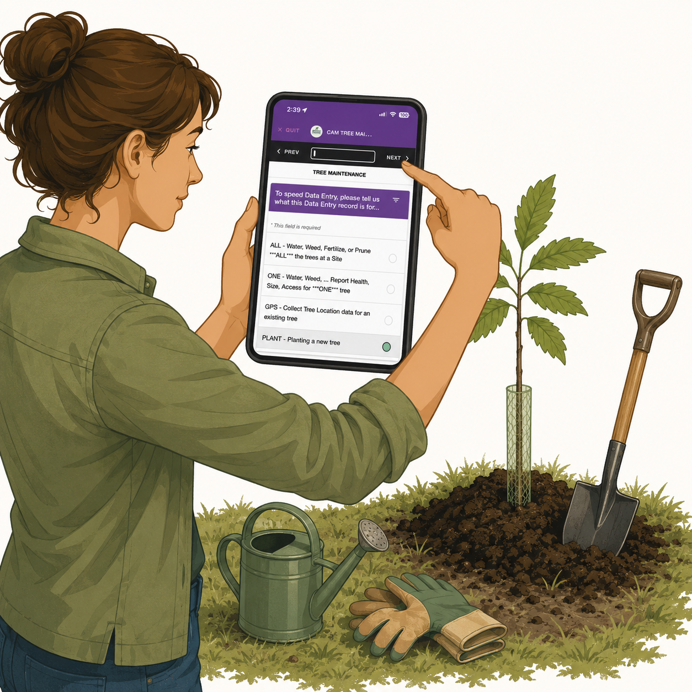

# {{ page.title }}

<table border="0" cellpadding="10">
  <tr>
    <td valign="top">
      
    </td>
    <td valign="center">
      
<h2>Using the   EpiCollect5   Mobile App</h2>

    </td>
  </tr>
</table>

The [EpiCollect5 mobile app](https://five.epicollect.net) is a free and easy-to-use
mobile data collection platform created by Oxford University.

The EpiCollect5 app is currently available for iOS (version 15+) and Android (version 10+).

EpiCollect5 can be used to collect data while in the field, even when standing next to a
chestnut tree without cellular service. If cellular service is available, data can be
uploaded immediately to the EpiCollect servers. Otherwise, the data can be uploaded later
when an internet connection becomes available.

CAM began using the EpiCollect5 mobile app about a year ago. The app has been well
received by volunteers, who find it easy to use. Data is collected when **planting a new
tree** and when **recording information about an existing tree**.

Kim Colson has created an extensive [CAM EpiCollect5 Quick Reference Guide](../assets/cam-epicollect5-quick-reference-guide-1.0.pdf),
which provides easy-to-follow instructions for using the app in the field.

When collecting tree data with EpiCollect5, you first select the CAM Organization and Tree
Site. You then follow one of six available data-entry pathways. The following table
describes each pathway and its intended use.

| Pathway      | Purpose                                                                           |
| ------------ | --------------------------------------------------------------------------------- |
| **PLANT**    | Data collected when planting a new tree                                           |
| **GPS**      | Recording the GPS location of an existing tree                                    |
| **ONE**      | Recording health data or performing care actions on a single tree                 |
| **ALL**      | Recording care actions (watering, weeding, etc.) performed on all trees at a site |
| **WildCAM**  | Recording information about a wild tree not yet known to TACF                     |
| **WildTACF** | Recording information about a wild tree already known to TACF                     |

#### Details of the Data Collected for Each Pathway

1. **PLANT** – Data collected when planting a new tree
	- CAMorg-Site – The CAMorg and Site where the tree lives.
	- Tree Number – The tree's three digit number with leading zeroes.
	- Mother Tree – The tree’s mother.
	- Mother Tree Other – A mother tree not in our EpiCollect dropdown list.
	- Father Tree – The tree’s father.
	- Father Tree Other – A father tree not in our EpiCollect dropdown list.
	- Parent Tree Note – Additional info regarding the tree’s lineage.
	- Tree GPS Location – The tree’s longitude and latitude.
	- Access Path – Wheelchair Accessible Trail, Hiking Trail, Auto Road, etc.
	- Access Level – Easy, Moderate, or Difficult.
	- Access Note – Any comment (if helpful) regarding the tree accessibility.
	- Planting Method – Short Tube, Tall Tube, etc.
	- Wire Fence – Was a Wire Fence placed around the tree.
	- Tree Photos – One photo of the tree’s tag, and one photo of the tree.
	- Care Actions – Actions (water, weed, etc.) performed.
	- Additional Info – Any info you feel like adding regarding the planting.

1. **GPS** – Data collected when recording the GPS Location for an existing tree
	- CAMorg-Site – The CAMorg and Site where the tree lives.
	- Tree Number – The tree's three digit number with leading zeroes.
	- Tree GPS Location – The tree’s longitude and latitude.
	- Additional Info – Any info you feel like adding regarding how to locate the tree.

1. **ONE** – Data collected when recording health data or performing care actions on a single tree
	- CAMorg-Site – The CAMorg and Site where the tree lives.
	- Tree Number – The tree's three digit number with leading zeroes.
	- Health – Good, Poor, or Dead.
	- Height – How tall is the tree (measured in feet and inches).
	- Diameter – How wide is the tree (in inches) at breast height.
	- Blight – Does the tree have blight.
	- Form – Straight or Branching.
	- Stump Sprouting – Are stump sprouts present.
	- Catkins – Are catkins present.
	- Blossoms – Are blossoms present.
	- Nut Production – None, Some, or Many.
	- Access Method – Equipment required to harvest or pollinate the tree.
	- Tree Photos – Two photos of the tree.
	- Care Actions – Actions (water, weed, etc.) performed.
	- Additional Info – Any info volunteer feels like adding.

1. **ALL** – Data collected when recording care actions (water, etc.) performed on ALL trees at a Site
	- CAMorg-Site – The CAMorg and Site where the tree lives.
	- Care Actions – Actions (water, weed, etc.) performed.
	- Additional Info – Any info you feel like adding regarding the trees.

1. **WildCAM** – Data collected when recording information for a wild tree unknown to TACF
	- Tree GPS Location – The tree’s longitude and latitude.
	- Access Path – Wheelchair Accessible Trail, Hiking Trail, Auto Road, etc.
	- Access Level – Easy, Moderate, or Difficult.
	- Access Note – Any comment (if helpful) regarding the tree accessibility.
	- Health – Good, Poor, or Dead.
	- Height – How tall is the tree (measured in feet and inches).
	- Diameter – How wide is the tree (in inches) at breast height.
	- Blight – Does the tree have blight.
	- Form – Straight or Branching.
	- Stump Sprouting – Are stump sprouts present.
	- Catkins – Are catkins present.
	- Blossoms – Are blossoms present.
	- Nut Production – None, Some, or Many.
	- Access Method – Equipment required to harvest or pollinate the tree.
	- Tree Photos – Two photos of the tree.
	- Care Actions – Actions (water, weed, etc.) performed.
	- Additional Info – Any info you feel like adding regarding the Wild tree.

1. **WildTACF** – Data collected when recording information for a wild tree known to TACF
	- Tree ID – ‘ME-‘ followed by two uppercase letters and three digits.
	- All the same data collected for a WildCAM tree in step 5 above.
