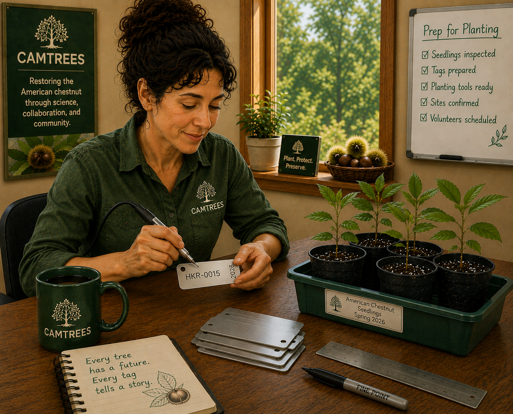

# {{ page.title }}

{: .warning }
This proposal does **not** describe the current tree-tagging process. It outlines a
proposed methodology for assigning tree tags beginning with the 2027 planting season.

* * * * * * * * * * * * * * * * * * * * * * * * * * * * * * * * * * * * * * * * * * * * 

## Goal

The goal of this proposal is to simplify the process of assigning every tree a unique
identifier (UID).

For this project, the unique identifier is called the **TAG-ID**. Each TAG-ID is assigned
to one—and only one—tree, ensuring that every tree can always be uniquely identified
throughout its lifetime.

## Inspiration

A tree's TAG-ID is similar to a vehicle's license plate.

A license plate contains only a unique combination of letters and numbers. When someone
needs additional information about a vehicle, such as its owner, make, model, or
registration, they simply look up the license plate in a database.

The proposed tree-tagging system works the same way.

The physical tag contains only the minimum information needed to uniquely identify the
tree. All additional information, such as the tree's mother, father, planting history,
health assessments, and location, is stored in the CAMTREES Database.

## Definitions

### Tree Manager

A **Tree Manager** is the person who either:

- Receives seedlings from a grower, greenhouse, or another source, or
- Grows a chestnut seedling from a nut

The Tree Manager is responsible for:

- Generating the TAG-ID
- Producing the metal tree tag
- Recording the tree's mother and father in EpiCollect

### TAG-ID

Every tree is assigned a unique **TAG-ID**. For example: **MAM-0048**

The TAG-ID consists of:

- The Tree Manager's three initials
- A hyphen (`-`)
- A four-digit sequential number

Each Tree Manager maintains an independent numbering sequence beginning with **0001** and
increasing by one for each seedling they manage.

### Tree Planter

A **Tree Planter** is a CAM volunteer who plants a tagged seedling at a planting site.

In many cases, the same individual serves as both the Tree Manager and the Tree Planter.
For purposes of this discussion, however, these responsibilities are treated as separate
roles.

## How the Proposed Tree Tag System Would Work

Suppose Mark, a Tree Manager, receives 20 seedlings from TACF (or another supplier). Each
seedling already has a white vinyl tag identifying its mother and father.

For each seedling, Mark would:

1. Generate a new TAG-ID

Generate the next available TAG-ID for the seedling (for example, **MAM-0048**).

- **The first three characters** are the Tree Manager's initials. In this example, **MAM**
indicates that Mark is the Tree Manager responsible for the seedling.
- **The fourth character** is always a hyphen (`-`).
- **The final four digits** are the next available number in the Tree Manager's personal
sequence. In this example, **0048** indicates that this is the 48th seedling managed by
Mark.

Each Tree Manager maintains an independent numbering sequence.

For example, if Lea's initials are **KLS** and she has already assigned TAG-IDs to 78
seedlings, the next TAG-ID she would create is **KLS-0079**.

2. Prepare the Metal Tree Tag

Etch the TAG-ID onto a blank metal tree tag.

For consistency, the TAG-ID should be engraved horizontally near the upper-left corner of
the tag.

Optionally, engrave the planting year vertically along the right edge of the tag, rotated
90° counterclockwise, as shown in the illustration above.

If CAM decides to include additional information on the tag, it should be engraved below
the TAG-ID.

3. Record the Tree in EpiCollect

Use EpiCollect to record the following information:

- TAG-ID
- Mother tree
- Father tree

A demonstration EpiCollect project has been created so Tree Managers can practice the
process before using the production project.

To try the test project:

1. Launch the EpiCollect app on your phone.
2. If necessary, return to the **Projects** screen.
3. Tap **+ Add Project**.
4. Enter **hkr** in the **Search for a project** field.
5. Select **HKR Tree TAG** to install the project.
6. Open the project and tap **+ Add Entry** to record a sample tree.

Testing shows that recording a new tree typically takes **25 to 30 seconds**.

4. Label the White Vinyl Tag

Write the TAG-ID on the back of the white vinyl tag supplied with the seedling.

This provides a backup method for identifying the seedling if the metal tree tag becomes
separated from the plant.

Use a permanent black marker.

5. Label the Seedling Pot

Write the TAG-ID on the outside of the seedling's pot.

This provides another backup method for identifying the seedling if the metal tree tag
becomes separated from the plant.

Use:

- A permanent **silver** marker on dark-colored pots.
- A permanent **black** marker on light-colored pots.

*Click the disclosure triangles above for additional details about each step.*

## Advantages of the New System

Each Tree Manager can create tree tags completely independently.

There is no need to:

- Check the CAMTREES Database.
- Coordinate with other Tree Managers.
- Contact any of the 42 CAM Organization coordinators.

A Tree Manager only needs two pieces of information:

- Their own initials.
- The next number in their personal sequence.

Tree Managers also do not need to know where a seedling will ultimately be planted. The
future CAM Organization and planting site have no effect on the TAG-ID or the information
shown on the tag.

Tree Planters no longer need to modify tree tags before planting.

Likewise, Tree Planters no longer need to record the tree's mother and father in the field
because that information has already been recorded by the Tree Manager during tag
creation.

Once assigned, a TAG-ID remains with the tree for its entire life.

If a tagged seedling dies before planting, both the seedling and its tag are simply
discarded. The TAG-ID is never reused. A replacement seedling receives a brand-new TAG-ID
and follows the same tagging process.

## Final Thoughts

This proposal is intended solely to provide a simple and reliable method for assigning a
permanent, unique identifier to every tree.

It does **not** limit the amount of information that could be engraved on a tree tag.
However, I recommend keeping the tag as simple as possible.

Ideally, each tag would contain only:

- The TAG-ID
- The year the tree was planted

The illustration above shows an example of this proposed tag design.

## Frequently Asked Questions

### Why are the Tree Manager's initials included in the TAG-ID?

Including the Tree Manager's initials is fundamental to this proposal.

It allows multiple Tree Managers to create TAG-IDs independently without any possibility
of duplicate identifiers.

Each Tree Manager always knows exactly which TAG-ID comes next. There is no need to
consult a database or coordinate with anyone else. Only the last number used in that
individual's sequence is needed.

Regardless of how many Tree Managers participate, or how many seedlings each receives,
assigning the next TAG-ID remains simple and predictable.

### How can I remember the last sequence number I used?

Whenever you create a batch of tree tags, make **one additional tag** using the next
sequence number.

Store this unused tag with your supply of blank tags.

The extra tag serves as a permanent reminder of the next TAG-ID to use, eliminating the
need to keep a separate written record.

### Will trees at a site still be numbered sequentially?

No.

In fact, that is often **not** true today (August 2026), even though some sites happen to
have sequential tree numbers.

Under the current system, numbering is sequential within a CAM Organization — not within
an individual planting site. Whether trees at a particular site have consecutive numbers
is simply a coincidence.

### When should I create the tree tags?

There are two good options:

1. **Create the tag as soon as you receive or begin growing a seedling.**
2. **Create the tag shortly before the seedling is ready to be planted.**

The first option spreads the workload over a longer period and avoids the last-minute rush
of creating large numbers of tags immediately before planting season.
